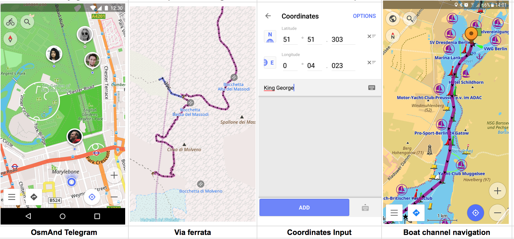

Happy New 2019 Year!
Following the nice tradition of creating the list of New Year Resolutions, on behalf of our team, I will create and share it here and hope it would be an appropriate post for the community.

<!--truncate-->

## 2018 achievements

* **Measure Distance.**
This is a long-expected UI simplification and enhancement to create GPX tracks as lines and as route points using a mobile phone. It allows:
* To draw lines and measure straight distances.
* To draw a route between selected points as car, pedestrian, bike even as boat on channels route. Basically it calculates a route between all intermediate points and so far we've tested up to 50-100 points.
* To save all edits as GPX track.
* Edit an existing GPX track.
* Easily accessible via Drawer menu.

* **OsmAnd Live maps.**
 In 2018 we've moved our implementation to Overpass and managed to achieve average delay 20 minutes after the improvements (90th percentile delay is less than 40 minutes). If we exclude all medium outages for 2-3 hours, which happens once a month, then average time between your edits and appearance on OsmAnd would be 10-15 minutes. So it gives a great tool to quickly verify changes on a spot. I've made a presentation at SOTM 2018 about it * https://youtu.be/ZHY0KE4IzWI
* **Travel * Wikivoyage.**
 We've launched a new travel category based on open data https://www.wikivoyage.org/ project. There were already some improvements how to open GPX files in OsmAnd and select specific categories i.e. Eat / Accommodation / See. We went further and made all that data available offline with cached images. By downloading 300 MB, you can have all travel articles around the World and enjoy your trips. Of course, Wikivoyage data is linked to Wikipedia articles about specific places, so for a complete picture, you will need to download Wikipedia as well.
* **iOS Navigation, Ruler and other.**
 We've finally made huge progress in our iOS version and managed to organize a small &amp; stable development group. One of the primary important features was Navigation which is a full copy of Android version including navigation on GPX and all parameters and vehicle support. This also included a variety of widgets added to iOS with an advanced version of Ruler which works in 3D as well.
* **OsmAnd Telegram.**
 It was a hard decision for us but we decided to go into a completely new area and make a product for active travelers OsmAnd Telegram. This is an online GPS tracker which allows you to share your location within a group of people and also see everybody on the map. Sharing your location is always linked with chat-messaging, so we decided to build on the most open social technology Telegram. We've put the OsmAnd API on a completely different level to support a complex application such as OsmAnd Telegram and we also plan to enhance that API, so more and more side-apps could enrich OsmAnd and make it easier to use for specific cases.

## 2019 resolutions

We knew our list up front and it was based on your emails and issues. We selected 5 most important directions for our small team of 9 people to make it happen.

* **Public Transport.**
 This feature is almost ready and we planned it for 2018 release though we will need to polish it and do a proper beta test. OsmAnd already has all transport lines clickable which dramatically improved in 2018, so you can view and validate the public transport lines.
* **Place Reviews!**
 This is probably the most important goal for 2019. We fully understand that we need to do something to fight for Open Reviews Data against Google, TripAdvisor who takes the data bound to its own products, rules and etc. It is time to make something like OpenStreetMap for Reviews and we've already found connections with other OSM app developers to build a unified platform. Obviously the data will be open for everybody and that is the only way to get enough reviews to rate the places.
* **Travel + Wikivoyage.**
 We've got positive feedback for integrating with Wikivoyage data but it is very obvious we need to do more. We plan to let people contribute back to Wikivoyage more actively, so the open data will be more up to date. We also need to split it by regions to make the maps smaller and generate them every month. So, there are lots of small and very important features to make it useful :)
* **iOS improvements: OsmAnd Live, Quick Action, OSM Editing.**
2018 was decisive for iOS version and we've started to work hard on features to reduce the gap between Android / iPhone version. In 2019, we are planning to release the most requested features, and the good sign is that iOS audience is growing very fast, reacting to the changes we do. OsmAnd Live, OSM Editing and Quick Action are even a shorter list what we plan to achieve in 2019.
* **OpenGL-rendering (speed up rendering).**
 This is a long-awaited feature and it is ready for iOS users but unfortunately, we didn't publish it for Android due to a big variety of devices on Android. It is available for public test as https://download.osmand.net/latest-night-build/OsmAnd-qt-arm-nightly.apk. Obviously, there are pros and cons: it is faster but more power consuming; it has 2.5D but not all layers are currently supported; it requires more resources for the same operations.

Happy New 2019 Year!

_____________________________

OsmAnd at <a href="https://www.facebook.com/osmandapp/">Facebook</a>, <a href="https://www.twitter.com/osmandapp/">Twitter</a>, and <a href="https://www.reddit.com/r/OsmAnd/">Reddit</a>!
Join us at our groups of Telegram <a href="https://t.me/OsmAndMaps">(EN)</a>, <a href="https://t.me/itosmand">(IT)</a>,  <a href="https://t.me/frosmand">(FR)</a>, <a href="https://t.me/deosmand">(DE)</a>, <a href="https://t.me/ruosmand">(RU)</a>, <a href="https://t.me/uaosmand">(UA)</a>.
