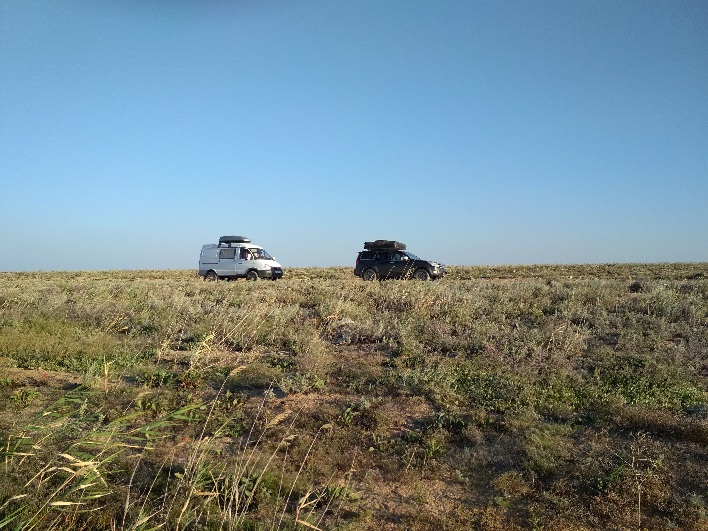
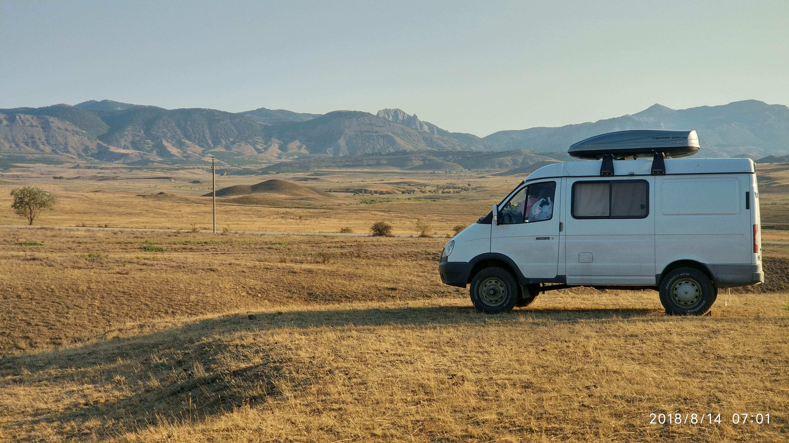
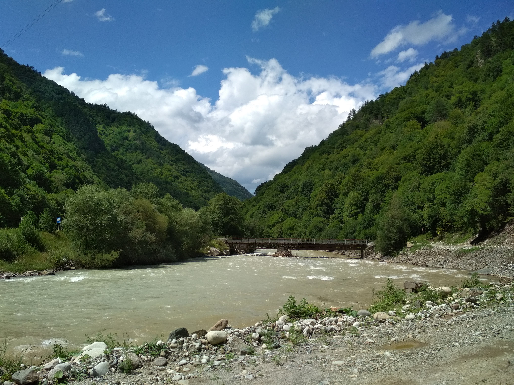
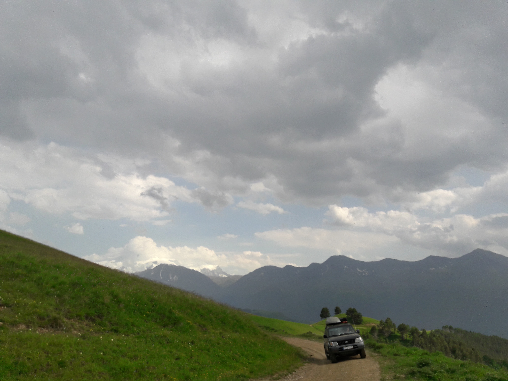
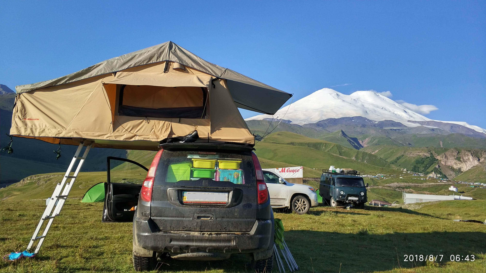

import AndroidStore from '@site/src/components/_buttonAndroidStore.mdx';
import AppleStore from '@site/src/components/_buttonAppleStore.mdx';

## Ilya: Chapter 1.

Our first interview will be with a mature traveler, who has lots of stories to tell! His name is Ilya and he will share his thoughts and adventures with You! For starters, we decided to ask him about his favorite types of traveling. _“We have recently started exploring the North of Caucasus, being more specific, Kabardino-Balkar Republic and Karachay-Cherkessia. And, afterwards, we spend the rest of our vacation on the seaside near Anapa. It is definitely the best way to enjoy the last days of the trip and have some relax after climbing and exploring. The temperature can be low in the mountains and the whole experience can be just a bit tiresome, so, some family members like to sunbathe f-  a few days on the beach. Time passes and our tastes change with it. The places we visit, our ways of living and traveling never stay the same for long. 15 * 20 years ago we would just go to the forest on foot and look for some mushrooms, while today we set to far and unexplored places.”_

<!--truncate-->

Not only can one use our app in the deep forests and high mountains, but they can also navigate through it in urban areas. The majority of popular places are  visible on the maps, which means that there- ill be no difficulty with finding your way to the best restaurant or any other place in any town. The places that You like the most can be specially marked * just save them in <a href="https://osmand.net/features/favourites">Favorites</a>!   <a href="https://osmand.net/features/osm-editing-plugin#How_to_use_it">Creating POI</a> will undoubtedly make your choice richer and easier.

Ilya is not just an active user of application, he is a developer, because he uses OsmAnd in practice. So, we wanted to know how long he had been using the app and whether he had tried any other program before. It was not an easy question to answer, but Ilya managed to come up with a great answer. _‘A nice one, I mean the question. I do not even remember the precise date. Years ago, I started using the app, at that time it was free. It was either alpha- r beta version, the ones that were the first to arrive at the Playmarket. Had I tried any other app before I switched to OsmAnd? I have to admit that for 5 * 10 years I used, so-called, “iron” navigators. Of course, they were made of plastic, but the name comes from a device that used to be attached to the system and the program. These were the Garmin devices._

 _Why did I switch then? If You know Garmin, You will agree that these are very complex and highly-functional devices with multiple navigating functions. The only exception, which also happened to be the exact thing that changed my mind, was the inability to exchange the coordinates with others on the spot. While an app shows everything, it is simply impossible to send your location fast. Basically, one can manually enter all the numbers and send them in a message, if and only if they have the connection. But it is so inconvenient and the chances of You missing a decimal are as high as ever. Choosing the format is another problem. That is why we finally set to find an alternative application to suit our needs. Ideally, we wanted to be able to send a location in one click._

_We have flicked through dozens of applications and programs, comparing them all to Garmin. I wanted to find a program that could save the coordinates in such a way that the data would be secured even if I destroyed or lost my device. Some locations and marks can be important and precious, so I was not particularly keen on losing them forever. My requirements also included the function of saving the file in GPX format, comparability with Garmin and other devices, and the access to our maps. However, nearly all of the programs of that time lacked these features. For instance, Magellan navigators still can not provide consistent maps of our regions, which is unfortunate. Unfortunate for them, of course. Even though Garmin was rather popular, it did not read the OSM maps._

 _Even then OsmAnd stood out from the rest. It fascinated us with its functions that included editing the maps, sending location, and seeing others on the map. Finally, Garmin has been forgotten. This is our story. The story that started my journey with OsmAnd. I have been using the app for 10 years now!’_

You can download OsmAnd from Play Market and App Store for free. The version You get does - t have all the functions. To get the access to all the functions <a href="https://osmand.net/features/osmand_purchases">just pay a small fee</a>, and -voila- You have the full membership! Help yourself to all the materials and functions. Every member can and is encouraged to develop <a href="https://www.openstreetmap.org">the maps</a> by editing. What is the best about OsmAnd? Its mobility! As long as you have your phone, You will have the maps. All maps <a href="https://osmand.net/features/start#Ways_to_download_maps">can be downloaded</a> in advance in case there is no internet connection. What else? Everything is synchronized and saved automatically by using other specialised programs! Your data is safe with us!

## Ilya: Chapter 2.

Ilya is has so much to say that we have decided to split the interview on two. Many people struggle when it comes to describing their experiences, but Ilya is definitely not one of them.

 Whatever we ask, he seems to be ready to answer. So, a reasonable question appeared, whether his preparation to every expedition is on the same level. _“Yes, it is tempting not to, but I still work on the maps beforehand. I call it the overall process of preparation. The majority of maps today is highly detailed and reliable, though, they are still far from being ideal. In fact, we are constantly developing them. As recent as 15-20 years ago, the situation was entirely different. Actually, I rarely do more than a simple check._

_The first thing is to decide, where we would like to go and what we would like to find there. Afterwards, through studying the map of the region, we try to come up with the best possible track. How can we get there? From which side? Which road should we take? We try to map our track so that there will be no unexpected dead ends. We also avoid going the same road twice. The trick is to work out a plan where all the dots are connected. That is what makes the trip so exciting._

_Some roads, however, are not marked in OsmAnd, even though they exist. For example, during our expedition in 2016, we found out that people actually drive from Kanjol Plateau to Dzhily-Su, they had shared their tracks on forums, where we, eventually, came across them. We marked it, so, now the track is there permanently. My friends and I usually search for the inconsistent spots, so as to draw them and decide on their tags. We also note the places we want to visit. That is how the process looks in a nutshell.”_

Have You noticed that Ilya mostly uses the pronoun **“we”**? He does it on purpose! Because he works on the maps with his friends. And, by doing so, not only does he improve the maps for himself, he also helps other members of the OsmAnd community. Detalising <a href="https://www.openstreetmap.org">maps</a> is a great way to help others and enrich their experience. 
Do You know the difference between a traveler and a tourist? Being a traveler means searching for something new - exploring. In OsmAnd we are all travelers - we want to go for more than just a luxurious all inclusive hotel. The sky is the limit! Everyone gets their shot at being a “Columbus” - open your small piece of America and share the knowledge with the community.

As You know, we are constantly developing our app for You, by editing <a href="https://osmand.net/features">new perks and features</a>. Ilya has come up with the list of his top functions.

_“Of course, the most important feature for every navigating system is to show the track, directions, and the map. Without this it is just a program that has nothing to do with navigation. Not only do we travel, but we also prepare the tracks. That is why other functions may come in handy. In the majority of programs, which are simpler than OsmAnd,  those functions cannot be found. For instance, many programs, including Google, have the function of measuring of distance directly. The function works perfectly fine on a computer, but should one try to use a mobile phone, there will be a problem. <a href="https://osmand.net/features/measure-distance">Measure distance</a> of OsmAnd, on the other hand, works perfectly fine. Luckily, I do have it and, therefore, I can link the roads that are not connected to each other. These are the places where the roads are yet to be drawn and the track cannot be constructed automatically._

_Sometimes a road can be marked as a “walking path”, which means that one can use it. You cannot include this into automatically made calculations, though. Back to Google. It has been specializing in urban areas since the beginning, and, therefore, does not cover mountain regions. <a href="https://osmand.net/features/trip-planning">OsmAnd does</a>. So many mountain roads that are correctly tagged! That makes it possible to work out a track smoothly and at the first attempt. And if it is not working, do it manually - estimate the distance and create a virtual simulator of your track. So, the first essential function is mapping a track and the second one is creating a virtual version of it. I prefer doing this a month or two before the actual expedition. The program should also be capable of marking the starting and the final points of the trip. For instance, let’s call them A and B and these dots do not need to be directly connected. OsmAnd allows both creating a track and, furthermore, changing its <a href="https://osmand.net/features/navigation#Save_navigation_route_GPX_file">format to GPX-file</a>, which imitates a complete track. And if You name the points accordingly, for instance, from Kanjol Plateau to Dzhily-Su, in future You will be able to use already checked maps that will spare Your time and nerves. The best tracks are the ones that you have sorted out in advance.”_

Should I turn right or left? One wrong decision might spoil the whole trip experience. OsmAnd will help to guide You through the process of preparation and will turn it into an exciting game, so to say. The game in which one should think carefully before making a move in order to reach the finish. And our “finish” is not just to get to a travel destination, it is to have a good time in process. Just be ready to roll!

_“Another important question is whether one can see their temporarily dots or turning points, so-called, navigational <a href="https://osmand.net/blog/osmand-2-8-released">markers</a>, on the map or not. These are the small flags and tags that are not saved with the map, but allow one to create transitory points to navigate during the trip. There is, in fact, another type of marking in OsmAnd, which simultaneously is an additional function, these are the saved points of interest, or just <a href="https://osmand.net/ru/features/osm-editing-plugin#How_to_use_it">POI</a>. You will not believe how convenient they are! The program also allows one to save them in GPX format, so they can restore POIs from the past even if they have switched to another device at some point. This function is rarely found in other applications. OsmAnd, however, allows its users to easily “rise from the dead” any long forgotten data.”_

You can always restore the data, using other specialised programs that will update your device automatically, which means that losing, destroying or changing a device is no longer a problem. Just have your OsmAnd app downloaded and get every single piece of information back!

_“The last but not least important function is filtering. I always apply several <a href="https://osmand.net/features/find-something-on-map#Find_Points_of_Interest"> filters of POI</a>. If, for example, one chooses not to turn them on, they will end up with a city map entirely covered with markers of places, which is confusing. That is why I strongly advise everybody to use their filters. It will help to get rid of thousands of irrelevant points of interest and flags. You do not want to turn them off entirely, though. There are some places that one will certainly need during an expedition. For instance, tire services or water sources, such as rivers and lakes, are inevitable, when it comes to a road trip. One will also have to find a place to stay overnight, such as a hotel, an apartment or a camping site. It is, indeed, vital to think about these small details. When it comes to mountain regions, I always try to turn on the filters of caves, waterfalls, and other wonderful places to bring them forward from the endless mass of other attractions. We will not visit all of them, definitely, but it is nice to be able to bear in mind the name of a site while passing through it. An explorer has to know where to find fresh water. Unless there is a city or town in the area of 100-200 kilometres, one will have to search for the natural sources, which can be time consuming and demanding. For these reasons, the perk of filtering is on my list. There are other features I would like to mention, they are less relevant, though.”_

 In everyday life, we always filter or feelings, surrounding, and information without noticing it. The same rule is applicable to traveling. There are simply too many places and sites in the world for us to visit, so we would be much better off just focusing on the ones that really matter. Prioritizing the sites will, undoubtedly, make your experience richer and more memorable. With OsmAnd it is as easy as pie! Just set the filters your way! Where to eat? Where to find water? Where to spend a night? These and other questions will be eliminated and your options will be narrowed down by the app in the blink of an eye.

We tend to get accustomed to the good things in our life fast. So, beware, OsmAnd is addictive, for it is one of the most convenient and outstanding tools on the market. We develop OsmAnd everyday and with your help the app will get more and more sophisticated and detailed. The more the merrier! Let us all travel and share our experience with the community, indifferently of the level of your experience. So, whether You go to explore the far mountains or just a nearby town - go there with OsmAnd and have a great time.

_________________________________________________
<<<<<<< HEAD
=======

<AndroidStore/>  <AppleStore/>

OsmAnd at <a href="https://www.facebook.com/osmandapp/">Facebook</a>, <a href="https://www.twitter.com/osmandapp/">Twitter</a>, and <a href="https://www.reddit.com/r/OsmAnd/">Reddit</a>!
 Join us at our groups of Telegram <a href="https://t.me/OsmAndMaps">(EN)</a>, <a href="https://t.me/itosmand">(IT)</a>,  <a href="https://t.me/frosmand">(FR)</a>, <a href="https://t.me/deosmand">(DE)</a>, <a href="https://t.me/ruosmand">(RU)</a>, <a href="https://t.me/uaosmand">(UA)</a>, <a href="https://t.me/osmand_es">(ES)</a>, <a href="https://t.me/osmand_pl">(PL)</a>.
>>>>>>> 2b19e7caf1b7e383306b3864ad298fd42452e508
