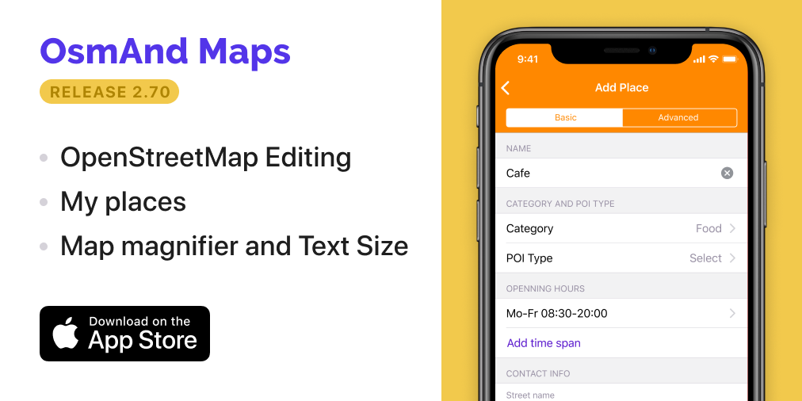

import AppleStore from '@site/src/components/_buttonAppleStore.mdx';
import Translate from '@site/src/components/Translate.js';

<a href="https://itunes.apple.com/us/app/osmand-maps-travel-navigate/id934850257">OsmAnd 2.70 is now available!</a>

<!--truncate-->

## OpenStreetMap (OSM) Editing

We continue to follow our <a href="https://osmand.net/blog/2019-ny-resolutions">New Year’s resolutions</a>, where we have promised to catch the iOS version of OsmAnd up with the one on Android, and we are getting there. 
OSM Editing allows you to make contributions to <a href="https://www.openstreetmap.org">OpenStreetMap</a>, a global community aimed at creating a comprehensive map of the world and providing up-to-date open-source data to every user.
The feature lets you create new objects, so-called <a href="https://wiki.openstreetmap.org/wiki/Points_of_interest">points of interest or POI</a> on the map and <a href="https://wiki.openstreetmap.org/wiki/Notes">OSM notes</a>.

So how to do it? Tap on the map where the new POI has to be placed → 'Actions' and press 'Create POI' or 'Open OSM Note' add its name and other details like working hours, website, etc. You'll also have to register at <a href="https://www.openstreetmap.org">OpenStreetMap</a> and then provide your OSM credentials to introduce changes.

<table>
  <tr>
    <th></th>
    <th></th>
    <th></th>
  </tr>
</table> 

There are all your "Edits" and "Notes" at general menu → 'My Places' → 'OSM Edits'. From this menu, you can delete or upload all your edits and notes.

<table>
  <tr>
    <th></th>
  </tr>
</table> 

## My places menu

Combined "Favorites", "Trips" and "OSM Edits" screens into a new 'My Places' screen.

<table>
  <tr>
    <th></th>
    <th></th>
  </tr>
</table> 

## What's new in the latest version of 2.70?

* Added options to control the size of map elements: use “Text Size” option to control the size of the text and icons on the map and “Map Magnifier” to control the overall size of map elements.

<table>
  <tr>
    <th></th>
    <th></th>
  </tr>
</table> 

* Opening a search result on the map will now zoom in on the selected point.
* Fixed icon sizes on map.
* Optimized multiple menus for iPhone X screen.
* Added Hungarian and Hungarian (formal) TTS, added alphabetical sorting to the TTS language list.
	

And remember that only together we can achieve the best results!
New features are coming SOON!

<AppleStore/>