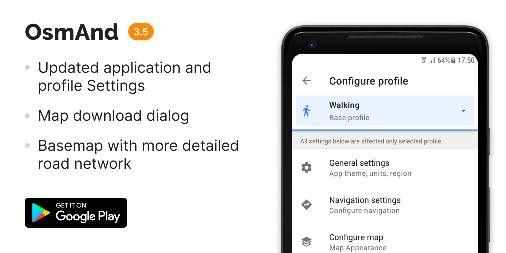

import AndroidStore from '@site/src/components/_buttonAndroidStore.mdx';
import LinksTelegram from '@site/src/components/_linksTelegram.mdx';
import Translate from '@site/src/components/Translate.js';

After a long pause, we are happy to announce the new 3.5 OsmAnd release for Android devices. You already can update the application in Google Play and check out the following long-awaited improvements in the new app version.

<!--truncate-->

## Updated application and profile Settings

We think that it is not very convenient to use default profiles for a very specific use-case. We give the opportunity to our users to make your profile with all settings, icons and etc.
We modified the general menu. Now you can choose and set any parameters for the navigation profile and switch on special plugins for each profile.

<table>
  <tr>
    <th></th>
    <th></th>
      </tr>
</table> 

Now you can create your own navigation profiles based on default profiles but with your parameters. To do this you should choose in the general menu Settings → Manage application profiles. In the new window, please click "+Add".

<table>
  <tr>
    <th></th>
    <th></th>
      </tr>
</table> 

We show an example of how to make your own profile. We choose Offroad type for driving a car when we use passes in forests, mountains, etc.
At first, it is necessary to choose a base profile. The most common is "Driving", but in this case, you can choose "Cycling", too. Next, we name our profile — "Offroad" — and select a Navigation type. In this case, it is "Bicycle".

<table>
  <tr>
    <th></th>
    <th></th>
      </tr>
</table> 

After that, we select an icon and color for our Navigation profile. As you can see, we prepared many icons for your future choices.

<table>
  <tr>
    <th></th>
    <th></th>
      </tr>
</table> 

We click the "SAVE" button to save our "Offroad" navigation profile.

After that, we go to the general menu, choose our "Offroad" navigation profile. We set all of its own parameters for the screen, map, navigation, and general settings. Of course, here we can switch on the desired plugins.

<table>
  <tr>
    <th></th>
    <th></th>
    <th></th>
    <th></th>
      </tr>
</table> 

Now we have our "Offroad" navigation profile in the Navigation panel. We can switch to and from our profile in the "Application profiles" menu.

<table>
  <tr>
    <th></th>
    <th></th>
      </tr>
</table> 

**In the next article in our blog, we will show you examples with navigation profiles. It will be Brouter and routing.xml for "Navigation type".**

## Export/Import navigation profiles

Now you can export or import navigation profiles. You should choose to '<Translate android="yes" id="configure_profile" /> → <Translate android="yes" id="shared_string_actions" />' (for export), for profile import you should select its file on the device and open it with OsmAnd.

<table>
  <tr>
    <th></th>
    <th></th>
    <th></th>
      </tr>
</table> 

## New map download dialog

Now when you want a map for a certain area you can tap directly on the World map and OsmAnd suggests downloading a map for the chosen area.

<table>
  <tr>
    <th></th>
    </tr>
</table> 

## Updated basemap

Now the World overview map has a more detailed road network and is smaller in size.

<table>
  <tr>
    <th></th>
    <th></th>
    <th></th>
    <th></th>
      </tr>
</table> 

## Ski routing

Now you can use ski routing. At first, you need to change the Map style in the Configure map menu to "Winter and ski". After that, you can use ski profile. We added height profile and route complexity to the route details.

<table>
  <tr>
    <th></th>
    <th></th>
    <th></th>
    <th></th>
      </tr>
</table> 

## Improved visibility of Underground objects

Now when you hide "Overground objects" (General menu-> Configure map-> Map rendering->Hide), the overground objects will become translucent, it is useful for the orientation of your underground objects.

<table>
  <tr>
    <th></th>
    <th></th>
      </tr>
</table> 

## Added color schemes for Contour lines

Now you can see Contour lines on dark overlays.

<table>
  <tr>
    <th></th>
    <th></th>
      </tr>
</table> 

## Add new category for Driving style of bicycle

We added "Prefer unpaved roads" to Driving style for bicycle profile. Now you can choose unpaved roads for your trips.

<table>
  <tr>
    <th></th>
    <th></th>
      </tr>
</table> 

## What else in this release?

* Night theme fixes
* Fixed a few routing issues around the world
* Fixed flooded areas around the world
* Bugs fixed

And remember that only together we can achieve the best results!
New features are coming SOON!

____________________________ 

OsmAnd at <a href="https://www.facebook.com/osmandapp/">Facebook</a>, <a href="https://www.twitter.com/osmandapp/">Twitter</a>, and <a href="https://www.reddit.com/r/OsmAnd/">Reddit</a>!
Join us at our groups of Telegram <a href="https://t.me/OsmAndMaps">(EN)</a>, <a href="https://t.me/itosmand">(IT)</a>,  <a href="https://t.me/frosmand">(FR)</a>, <a href="https://t.me/deosmand">(DE)</a>, <a href="https://t.me/ruosmand">(RU)</a>, <a href="https://t.me/uaosmand">(UA)</a>.

<LinksTelegram/>
<AndroidStore/>