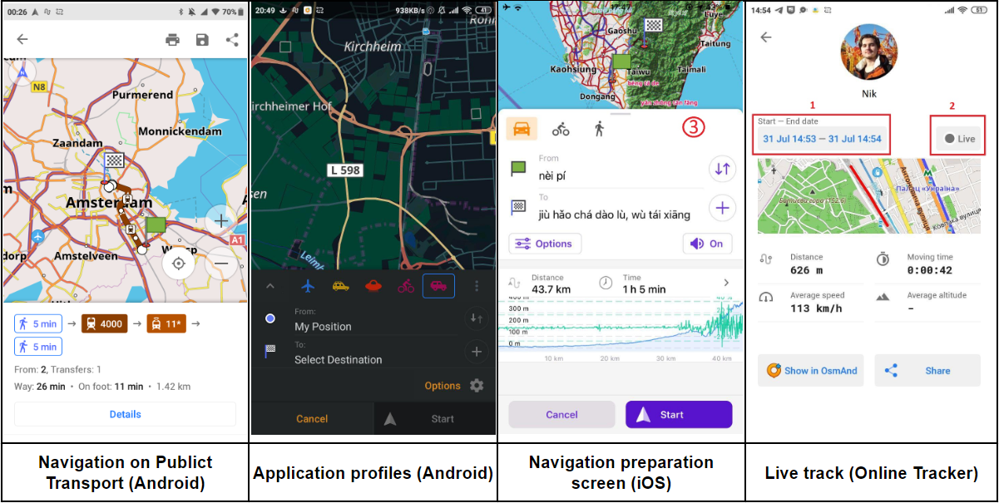
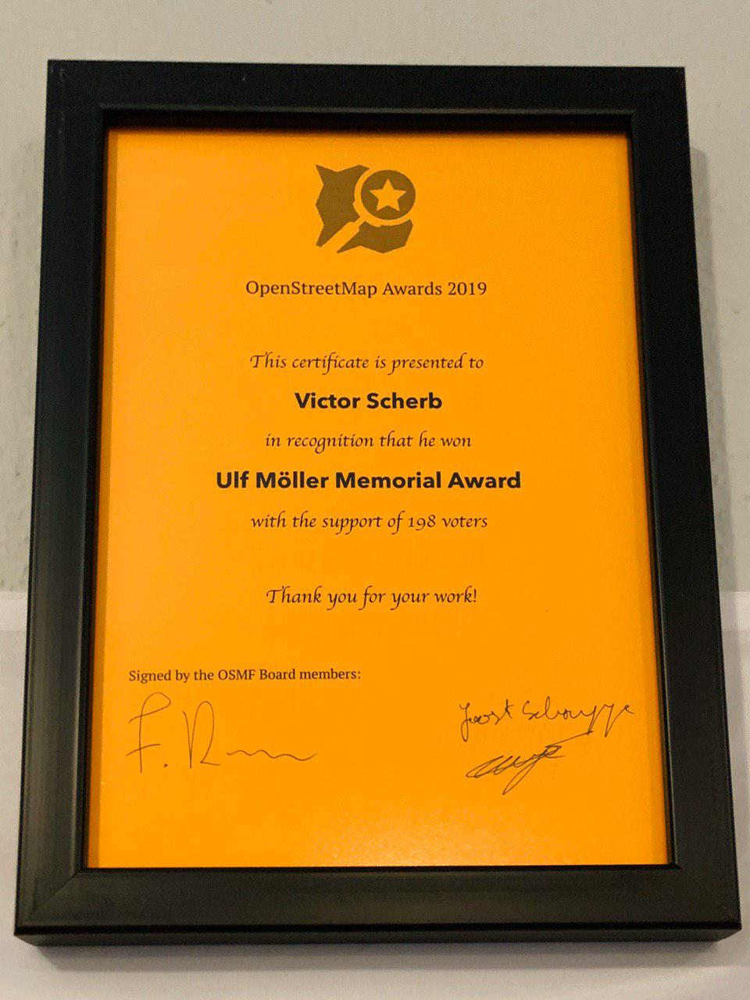

import LinksTelegram from '@site/src/components/_linksTelegram.mdx';
import LinksSocial from '@site/src/components/_linksSocialNetworks.mdx';

Happy New 2020 Year!

Every year we follow tradition to write New Year Resolutions. First of all we would like to describe our achievements, compare them with <a href="https://osmand.net/blog/2019-ny-resolutions">the 2019 Resolutions</a> and prepare a new list for 2020.

<!--truncate-->

## 2019 achievements

First of all, we would like to congratulate our CEO **Victor Shcherb** who received the Ulf Möller Memorial Award during <a href="http://weeklyosm.eu/archives/12408">SotM-2019</a> in Heilderberg, Germany for creating OsmAnd application and supporting it over the years, keeping it the only major OSM-based app with no corporate influence, and constantly imagining ways to expand the access to the open data for regular users.

### Android

OsmAnd Android got 3 major releases this year (<a href="https://osmand.net/blog/osmand-3-3-released">3.3</a>, <a href="https://osmand.net/blog/osmand-3-4-released">3.4</a>, <a href="https://osmand.net/blog/osmand-3-5-released">3.5</a>) with more than <a href="https://github.com/osmandapp/Osmand/milestones?state=closed">300 public features and issues closed on Github</a>. Among all these features we’ve selected 3 major features which were in the Resolutions list for 2019.

* **Public transport**

<table class="blogimage">
  <tr>
    <th></th>
    <th></th>
      </tr>
</table> 

We’ve introduced Navigation for public transport in early <a href="https://osmand.net/blog/osmand-3-3-released">version 3.3</a> and did multiple fixes in <a href="https://osmand.net/blog/osmand-3-4-released">3.4</a> as well. You can also watch the presentation on Youtube.

[Video presentation](https://www.youtube.com/embed/SPab09kaWPc)

It was an important step to introduce Public Transport worldwide without limits. We dealt with thousands map issues and we welcomed OSM-community <a href="https://osmand.net/blog/guideline-pt">to improve the map</a> and use OsmAnd to test this feature.

We know that many users are waiting for the schedule support or at least [opening_hours] + [interval]. And we have plans to implement it in 2020.

* **Application profiles**

<a href="https://osmand.net/blog/osmand-3-5-released">New application profiles</a> is our long term goal and we’ve started working on it this year. There is a lot of work left for 2020, though we try to bring something new each release to give an impression of the end goal and get necessary feedback from our users. So far, all settings are profile-dependent, so you can customize the application for multiple purposes.

<table class="blogimage">
  <tr>
    <th></th>
    <th></th>
      </tr>
</table> 

The most important update was the ability to create custom profiles and import and export settings associated with this profile. You can choose a specific icon and color to have a unique look and feel for each profile. Next year we are planning to include associated Quick Actions, Maps, custom Poi Categories, Plugins etc.

* **Powerful Route details**

<table class="blogimage">
  <tr>
    <th></th>
    <th></th>
      </tr>
</table> 

As of <a href="https://osmand.net/blog/osmand-3-3-released">3.3</a>, route details screen has important information about road types, surface conditions, steepness displayed in a nice visual way. It is our top priority to migrate that functionality to iOS. This mechanism is quite advanced and everybody can contribute and create their own metrics by simply modifying the rendering style on the device. In this regard, we want to thank <a href="https://www.reddit.com/r/OsmAnd/comments/dndhsg/pieter_with_osmand_from_2011/">Peter</a>, who contributed road information for Ski Pistes this way.

<table class="blogimage">
  <tr>
    <th></th>
    <th></th>
      </tr>
</table> 

* **What else?**

We’ve redesigned **Directions screens**, improved **Quick action**, added a **Widget with Current Coordinates** and **the Compass** to the Radius ruler, added **Ski Routing**, updated **Basemap**, **Desert style** for map and lot’s of else.

<table class="blogimage">
  <tr>
    <th></th>
    <th></th>
    <th></th>
    <th></th>
      </tr>
</table> 

### iOS

We’ve managed to release **7 new versions** of OsmAnd for iOS this year (<a href="https://osmand.net/blog/osmand-ios-2-5-released">2.5</a>, <a href="https://osmand.net/blog/osmand-ios-2-7-released">2.7</a>, <a href="https://osmand.net/blog/osmand-ios-2-8-released">2.8</a>, <a href="https://osmand.net/blog/osmand-ios-2-9-released">2.9</a>, <a href="https://osmand.net/blog/osmand-ios-3-0-released">3.0</a>, <a href="https://osmand.net/blog/osmand-ios-3-10-released">3.10</a>, <a href="https://osmand.net/blog/osmand-ios-3-11-released">3.11</a>)! All this was possible due to the commitment and hard work of our iOS team to catch up with Android. We hope 2020 to be a year in which almost all features present in OsmAnd will be equal for both Android and iOS version. Here the list of main features released this year for the iPhones and iPads.

* **OsmAnd Live**

<a href="https://osmand.net/features/subscription">OsmAnd Live</a> is a subscription that provides you numerous benefits, including unlimited map downloads, access to all paid features and hourly map updates.

* **OpenStreetMap (OSM) Editing**

OSM Editing allows you to make contributions to <a href="https://www.openstreetmap.org/">OpenStreetMap</a>, a global community aimed at creating a comprehensive map of the world and providing up-to-date open-source data to every user.

<table class="blogimage">
  <tr>
    <th></th>
    <th></th>
      </tr>
</table> 

* **Mapillary for iOS**

We're proud to have collaboration with <a href="https://www.mapillary.com/">Mapillary</a> available on iOS as well. Now you can view the street-level imagery in your location or anywhere in the world using the Mapillary.

<table class="blogimage">
  <tr>
    <th></th>
    <th></th>
      </tr>
</table> 

* **Quick Action menu**

<a href="https://osmand.net/features/quick-action">This feature</a> was requested many times this year and we were proud to deliver it in 2019. It allows you to have instant access to various actions with 2 clicks from the main screen, e.g. to change a map style, to show specific POI, to switch between raster maps or disable some layers.

<table class="blogimage">
  <tr>
    <th></th>
    <th></th>
      </tr>
</table> 

* **Support of Online SQL maps**

We’ve implemented the support of the same map sources as we have on Android including *.sqlite with dynamic online loading. Moreover, we’ve added even more map sources to "Online maps".

* **New Navigation Screen and Graphs**

You can now add a "Home", "Work" point as a destination. The short way to the Navigation settings menu. When your trip is ready, you can see the altitude/slope graph.

<table class="blogimage">
  <tr>
    <th></th>
    <th></th>
      </tr>
</table> 

### OsmAnd Online GPS Tracker

During this year we made 3 releases of <a href="https://osmand.net/features/tracker">our Tracker</a> (<a href="https://osmand.net/blog/osmand-tracker-0-4-released">0.4</a>, <a href="https://osmand.net/blog/osmand-tracker-0-5-released">0.5</a>, <a href="https://osmand.net/blog/osmand-tracker-0-7-released">0.7</a>).

<table class="blogimage">
  <tr>
    <th></th>
    <th></th>
      </tr>
</table> 

## New Year Resolutions 2020

We are going to start next year with an extended team of 7 software engineers. We grew 20% compared to the previous year and it is good news. We can probably do 10% more in 2020 :-)

Our list is growing every year and, as of today, we have around 1500 requests waiting to be fixed or implemented. That’s why, it is important for us to set up some public goals and try to follow them to a certain extent.

### GENERAL

* **New slopes / hillshade maps**
 In 2019 we’ve released updated contour lines worldwide and started working on new raster hillshade and slope maps. We want to provide more detailed raster maps and also add a new type of maps to better visualize slopes.
* **Profiles on Android + iOS**
 This is considered to be the most important feature of 2020. The implementation has already started in 2019 and now Android users can create / import and export custom profiles with user-defined settings. We’re going to continue profile’s customization, so every profile could look and feel as a separate geo-specialized application. We also want to make it easy to share  the profiles with others.

### Android

* **OpenGL-rendering + 2.5D**
 This is a long running feature for several years and we have a prototype build, we’ve already added some features to our roadmap to be implemented. Though we are not planning to make it mainstream unless it will be very successful. You can always check out the version we have at <a href="https://download.osmand.net/latest-night-build/OsmAnd-qt-arm-nightly.apk">our build server</a>.
* **Travel + Wikivoyage improvements**
 This year we didn’t manage to implement many features related to Wikivoyage, though it is always in our focus. We plan to make a second version inspired by our new plugin architecture.
* **Local GPX-access**
 Every year we develop many tiny and useful features related to GPX and this year was not an exception. We’ve closed more than 50 GPX-related issues. In 2020 we plan to add new features, that will change the way of ineraction with the GPX tracks on the map, browsing and searching among large list of GPX files and add new ways of visualizing GPX-activities.

### iOS

* **Public Transport**
 This feature was completed for Android in 2019 and we plan to migrate all the implemented solutions to the iOS version in 2020. So OSM-ers with iPhones will get a new motivation to map public transport in OSM (<a href="https://osmand.net/blog/guideline-pt">check out our guideline</a>).
* **Measure Distance**
 We’ve got a lot of requests for <a href="https://osmand.net/features/measure-distance">this tool</a> and for sure it is number 1 priority to get it for iOS in 2020.
* **GPX**
 While the Android version has more advanced GPX-related features, the iOS version still lacks some base route graphs and stats. Of course it is very important for us not to miss those next year.

Sure, hundreds of small features didn’t get to this list though they’re going to be implemented in 2020.
Happy 2020 and let’s welcome 2020 OsmAnd!!!
_____________________________

<LinksSocial/>
<LinksTelegram/>