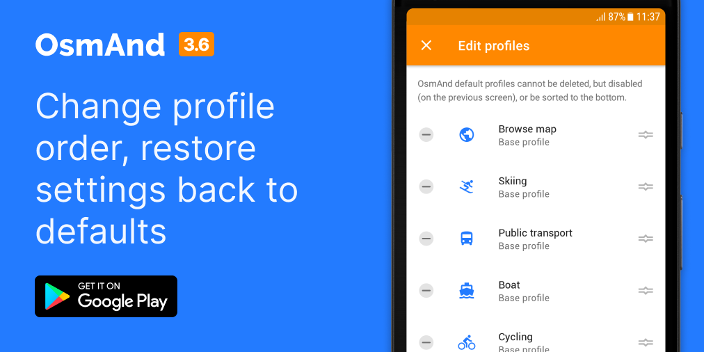

import AndroidStore from '@site/src/components/_buttonAndroidStore.mdx';
import LinksTelegram from '@site/src/components/_linksTelegram.mdx';
import LinksSocial from '@site/src/components/_linksSocialNetworks.mdx';
import Translate from '@site/src/components/Translate.js';

Great news for Android users!
We're happy to announce the new 3.6 OsmAnd release for Android devices.
<a href="https://play.google.com/store/apps/details?id=net.osmand">Update your OsmAnd</a>, check out all the new features and let us know if you like everything!

<!--truncate-->

## Profiles

Now you can change the order, set each one's icon for the map, change all settings for base profiles and restore them back to defaults

We improved settings for navigation profiles. Now you have more opportunities for transforming your navigation profiles and base profiles too. You can read <a href="https://osmand.net/features/navigation-profiles">the article "Navigation profiles"</a>.

<table class="blogimage">
  <tr>
    <th></th>
    <th></th>
      </tr>
</table> 

## Exit number in the navigation (Voice & UI)

For your comfortable navigation during riding, we show exit numbers at the top of the screen.

<table class="blogimage">
  <tr>
    <th></th>
    <th></th>
      </tr>
</table> 

## Round globe

Now Earth is considered to be a sphere for direct-distance and calculates arcs every 10 km if it matters much for boat-navigation and flight-navigation.

<table class="blogimage">
  <tr>
    <th></th>
      </tr>
</table> 

## New navigation type: Direct-to-point

We added a new type of navigation: **Direct-to-point**. Direct-to-point navigation is a critical and frequently used feature for marine users.
It is possible to specify the recalculation distance (by default it is OFF for this routing profile): *<Translate android="yes" id="configure_profile" />-> Navigation settings-> Route parameters->Minimal distance to recalculate the route.*
Also, you can see a point projection that represents the distance to the end point on the line. The point on the line is a virtual point to show the distance (it is not a projection on the line) but a point that has the same distance as current location to the finish point.
So it is easy to measure the progress and it is possible to use measurements tool to get correct distance.

<table class="blogimage">
  <tr>
    <th></th>
    <th></th>
      </tr>
</table> 

## Improved version of Straight-Line navigation

We also refactored how Straight-Line navigation works.
There is also a new setting to specify at which distance of user's location from route to start recalculation: <Translate android="yes" id="configure_profile" />-> Navigation settings-> Route parameters->Minimal distance to recalculate the route..
We have also implemented a new setting. In case if you deviate from the route during the navigation, this setting builds the shortest path from your current position to the calculated route with the maximum angle.
In other words, if the angle is higher than the one set by the user, OsmAnd calculates the next point of the route to build an additional route segment, so the angle will be valid.

<table class="blogimage">
  <tr>
    <th></th>
    <th></th>
      </tr>
</table> 

## More about the release

* Support of custom icons for GPX + Home / Work icons for favorites

Now we added Home / Work icons for favorites, it's very easy to find Home/Work on the map.

<table class="blogimage">
  <tr>
    <th></th>
    <th></th>
      </tr>
</table> 

* Now Sunset / Sunrise is visible in Configure Map

You can find <a href="https://osmand.net/features/map-viewing#Customize_map_Android">*Map mode*</a> within *Configure map* and choose your setting for it.
Now you see information about *Sunset* or *Sunrise* in the second line of *Map mode*.

<table class="blogimage">
  <tr>
    <th></th>
    <th></th>
      </tr>
</table> 

* Antarctica map

The map of Antarctica is available now in our application. You can find the Map of Antarctica and Wikipedia files in *Download maps*.

<table class="blogimage">
  <tr>
    <th></th>
    <th></th>
      </tr>
</table> 

* Customize order and appearance of POI categories in Search

In this release you can modify the order of the POI list. For this, you can go to *Search* within the menu or click the Search button, choose *Categories*. At the bottom of the list, you can click to *Rearrange Categories*.

<table class="blogimage">
  <tr>
    <th></th>
    <th></th>
      </tr>
</table> 

## What else is in this release?

* Completely reworked Settings screen for quick access to all profiles
* Align with cm-precision POI icons and display text to fit the borders on the map
* Embed correct transliteration into the map of Japan

And remember that only together we can achieve the best results!
New features are coming SOON!

____________________________ 

<LinksSocial/>
<LinksTelegram/>
<AndroidStore/>