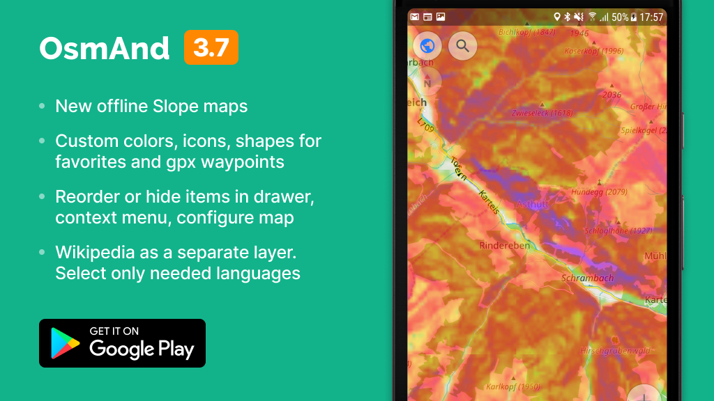

Great news for Android users!
We're happy to announce the new 3.7 OsmAnd release for Android devices.
<a href="https://play.google.com/store/apps/details?id=net.osmand">Update your OsmAnd</a>, the new version has become even more convenient for your trips!

<!--truncate-->

## New offline slope maps, see slopes  directly on the maps

You can estimate slopes in your route. We changed menu <i>Hillshades</i> to <i>Terrain</i> in <i>Configure map</i> menu where you can set slopes and hillshades for your map. Now you can choose transparency and zoom levels for your terrain layer. Switch on the <i>Contour line plugin</i> at first, you can read more about the <a href="https://osmand.net/features/contour-lines-plugin">Contour lines plugin here</a>. Remember that you can download slopes and hillshade maps for your region.

<table>
  <tr>
    <th></th>
      </tr>
</table> 

## Full customization of Favorites and GPX Waypoints - custom colors, icons, shapes

You can customize Favorites and GPX Waypoints. When you edit or create a new point you can choose colors, icons, and shapes for it. Now your points will be more interesting on the map. Read more about favorites <a href="https://osmand.net/features/favourites">here</a>.

<table>
  <tr>
    <th></th>
    <th></th>
      </tr>
</table> 

## Customize items order in Context Menu, Configure Map, Drawer

In the new OsmAnd update you can customize quantity and order of items in Drawer, configure map and context menu. Go to <i>general menu (Drawer)-> Configure profile(Choose profile)-> UI Customization</i>.

<table>
  <tr>
    <th></th>
      </tr>
</table> 

You can copy settings of UI Customization from another profile or reset to default. Of course, you can hide items and change their order.

<table>
  <tr>
    <th></th>
      </tr>
</table> 

## Wikipedia as separate layer in Configure map, select only needed languages

During travel, you need to know about interesting places near you. Now you can set viewing Wikipedia articles on the map with needed languages in a special menu. For this go to <i>Configure map-> Wikipedia</i>, choose the required languages for articles. After that, POI of Wikipedia will appear on the map. Read more about Wikipedia articles in OsmAnd <a href="https://osmand.net/features/travel#Wikipedia_A">here</a>.

<table>
  <tr>
    <th></th>
    <th></th>
    <th></th>
    <th></th>
      </tr>
</table> 

## Create your own POI filter / maps with total flexibility

You can create your custom search of POI, and show its on the map. To do it, go to <i>Search menu-> Categories-> Custom Search</i>. After that, choose the necessary categories, select your items and click <i>Show</i>. For viewing POI on the map you can click to <i>Show custom filter on the map</i>. Now you can see your custom search of POI on the map.

<table>
  <tr>
    <th></th>
    <th></th>
    <th></th>
    <th></th>
      </tr>
</table> 

When you use your own <i>Custom Search</i>, you can add more details of searching. For this, click the <i>Filters</i> button and choose additional settings for your searching. You can save your <i>Custom search</i> by clicking to <i>Save button</i> on the screen. Now you can find the required POI by clicking to own category in the searching list.

<table>
  <tr>
    <th></th>
    <th></th>
    <th></th>
    <th></th>
      </tr>
</table> 

## Add options to restore settings for custom profiles

If you change the base profile settings you can reset them to default. To do this, go to the <i>general menu-> Configure profile (choose the Base profile)-> Actions (Reset to default)</i>.

## Full GPX routes from Navigation support traffic lanes and complete turn instructions

If you save <a href="https://osmand.net/features/navigation#Save_navigation_route_GPX_file">navigation route as a GPX file</a> or with a <a href="https://osmand.net/features/measure-distance">measure distance</a> tool, this GPX file will keep all the information about traffic lanes and complete turn instructions.

<table>
  <tr>
    <th></th>
    <th></th>
    <th></th>
    <th></th>
      </tr>
</table> 

## Custom Package

Now, you can <a href="https://osmand.net/blog/custom-package">create your own plugin with custom settings</a> and all your parameters for OsmAnd. It is not easy and soon we will add a tutorial to our website on how to do it.
We think it will be very easy to send the necessary setting, maps, rendering files, navigation profiles, etc. to your friends and other OsmAnd users. You can create your own assembly for OsmAnd.

<table>
  <tr>
    <th></th>
    <th></th>
      </tr>
</table> 

## What else is in this release?

- Fix UI sizes on tablets
- Fix bugs with RTL

And remember that only together we can achieve the best results!
New features are coming SOON!

____________________________ 

OsmAnd at <a href="https://www.facebook.com/osmandapp/">Facebook</a>, <a href="https://www.twitter.com/osmandapp/">Twitter</a>, and <a href="https://www.reddit.com/r/OsmAnd/">Reddit</a>!

Join us at our groups of Telegram <a href="https://t.me/OsmAndMaps">(EN)</a>, <a href="https://t.me/itosmand">(IT)</a>,  <a href="https://t.me/frosmand">(FR)</a>, <a href="https://t.me/deosmand">(DE)</a>, <a href="https://t.me/ruosmand">(RU)</a>, <a href="https://t.me/uaosmand">(UA)</a>.

import AndroidStore from '@site/src/components/_buttonAndroidStore.mdx';

<AndroidStore/>