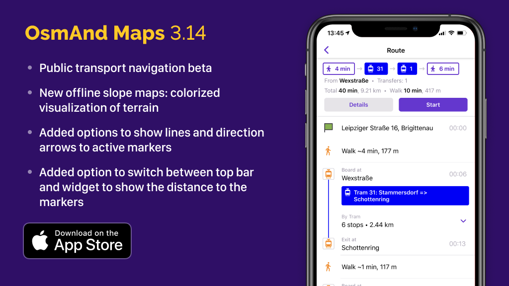

import AppleStore from '@site/src/components/_buttonAppleStore.mdx';
import Translate from '@site/src/components/Translate.js';

Great news for iOS OsmAnd users!
We're glad to announce the new <a href="https://itunes.apple.com/us/app/osmand-maps-travel-navigate/id934850257">OsmAnd version for iOS</a>.
Update your OsmAnd, check out all the new features and let us know if you like everything!
We promise to continue improving the OsmAnd app and make it even more useful for trips and everyday rides to make your life set.

<!--truncate-->

- Beta of Public transport navigation
- New offline slope maps
- Update UI for Contour lines
- Update UI for Overlay/Underlay screens
- Update Map markers
- Update Favorites menu

## Beta of Public transport navigation

In the new release, we would like to introduce Navigation for public transport which is currently in the beta phase for the iOS version of OsmAnd. Each of you can try to navigate in your city by public transport now with OsmAnd. Most importantly, we use the Public Transport Version 2 (PTv2) for our Public Transport navigation algorithm. You can check your public transport <a href="http://tools.geofabrik.de/osmi/">here</a>. <a href="https://osmand.net/blog/guideline-pt">Guidelines on how to build or correct public transport routes </a>are provided in our blog.

<table>
  <tr>
    <th></th>
    <th></th>
    </tr>
</table> 

Video about public transport navigation in OsmAnd:

<iframe width="1519" height="554" src="https://www.youtube.com/embed/SPab09kaWPc" frameborder="0" allowfullscreen></iframe>

## New offline slope maps

Added Slope maps, now you can control Slope and HillShade in new Terrain menu.
You can estimate slopes in your route. We changed menu <i>Hillshade (Overlay/Underlay)</i> to <i>Terrain (Overlay/Underlay)</i> in <i>Map</i> menu where you can set slopes and hillshades for your map. Now you can choose transparency and zoom levels for your terrain layer. Switch on the <i>Contour line plugin</i> at first, you can read more about the <a href="https://osmand.net/features/contour-lines-plugin#How_to_use_it_I">Contour lines plugin here</a>. **Remember** that you can download slope and hillshade maps for your region.

<table>
  <tr>
    <th></th>
    </tr>
</table> 

## Update UI for Contour lines

The <i>Contour lines</i> menu was also modified. Now it’s more convenient to adjust the contour lines on your map. You can read more about the <a href="https://osmand.net/features/contour-lines-plugin#How_to_use_it_I">Contour lines plugin here</a>. Note that you can download Contour lines for your region.

<table>
  <tr>
    <th></th>
    <th></th>
    </tr>
</table> 

## Update UI for Overlay/Underlay screens

We changed the UI of Overlay/Underlay screens (<i>Map-> Overlay/Underlay</i>).

<table>
  <tr>
    <th></th>
    <th></th>
    <th></th>
    </tr>
</table> 

## Update Map markers

We added options to show lines and direction arrows to active markers, now you can switch between topbar or a widget. Read more about Map markers <a href="https://osmand.net/features/map-markers#map_markers_I">here</a>.

<table>
  <tr>
    <th></th>
    <th></th>
    </tr>
</table> 

## Update Favorites menu

Now you can minimize <a href="https://osmand.net/features/favourites#Using_favorites_ios"><i>Favorites groups</i></a> in <i>My places</i> menu.

<table>
  <tr>
    <th></th>
    <th></th>
    </tr>
</table> 

And remember that only together we can achieve the best results!
New features are coming SOON!

<AppleStore/>
