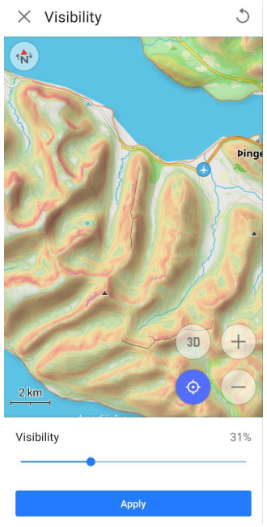
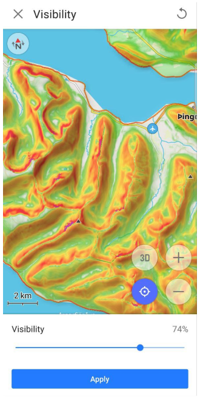
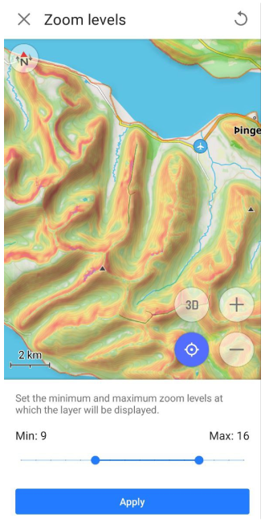

import Tabs from '@theme/Tabs';
import TabItem from '@theme/TabItem';
import AndroidStore from '@site/src/components/buttons/AndroidStore.mdx';
import AppleStore from '@site/src/components/buttons/AppleStore.mdx';
import LinksTelegram from '@site/src/components/_linksTelegram.mdx';
import LinksSocial from '@site/src/components/_linksSocialNetworks.mdx';
import Translate from '@site/src/components/Translate.js';
import InfoIncompleteArticle from '@site/src/components/_infoIncompleteArticle.mdx';
import ProFeature from '@site/src/components/buttons/ProFeature.mdx';
import InfoAndroidOnly from '@site/src/components/_infoAndroidOnly.mdx';

<InfoIncompleteArticle/>

## Overview

:::tip NOTE
The Topography plugin is a paid feature of the OsmAnd app.  
:::

Topography is an important feature of cartography that provides information to visually assess the terrain's relief. 
Topography information like [*Contour lines*](#contour-lines), [*Terrain*](#terrain) (*Hillshade* and *Slope*) and [*3D Relief*](#3d-relief) helps to make a visual assessment of the lay of the land by seeing elevation, relief, extremes, steepness, or points of equal height. 

Each feature provided by this plugin is an independent map layer that, when enabled, can be displayed above or below the main map source depending on the [settings](../map/raster-maps.md#overlay-layer).  

The Topography plugin provides access to the following map types:  

- [**Contour lines**](#contour-lines). This is a [vector map](../map/vector-maps.md) represented in [**meters** or **feet**](#meters-or-feet). Contour lines show elevation levels and help visualize the terrain.
- [**Hillshade**](#hillshade-slope-and-altitude-layers). Types of map with shading of hills and slopes, which makes the relief more visible and helps to visually interpret the terrain. 
- [**Slope**](#hillshade-slope-and-altitude-layers). [Raster](../map/raster-maps.md) layer that provides information about the steepness of slopes, which can be important for route planning and safety. 
- [**3D Relief**](#3d-relief). It is a [vector map](../map/vector-maps.md) that provides a three-dimensional representation of the terrain, available only with [OsmAnd Pro subscription](../purchases/index.md). 

<Tabs groupId="operating-systems">

<TabItem value="android" label="Android">

  

</TabItem>

<TabItem value="ios" label="iOS">

   

</TabItem>

</Tabs>

#### A license for DEM data used by OsmAnd for terrain detection

The altitude data on the map (between 70 degrees north latitude and 70 degrees south latitude) were obtained from measurements made as a part of the *Shuttle Radar Topography Mission (SRTM)*. It utilized the *Advanced Spaceborne Thermal Emission and Reflection Radiometer (ASTER)*, the primary imaging tool in *NASA's Earth Observation System*.  
For complete information, see the [License](https://github.com/osmandapp/OsmAnd/blob/master/LICENSE#L146).

DEM (DSM) data
 
   - <a href="https://www.eorc.jaxa.jp/ALOS/en/index_e.htm">ALOS DEM</a>. The original data used for this product was supplied by JAXA’s AW3D. 
	- <a href="http://hydro.iis.u-tokyo.ac.jp/~yamadai/MERIT_DEM">MERIT DEM.</a> 
	- <a href="https://doi.org/10.7910/DVN/OHHUKH">ArcticDEM</a>: Porter, Claire; Morin, Paul; Howat, Ian; Noh, Myoung-Jon; Bates, Brian; Peterman, Kenneth; Keesey, Scott; Schlenk, Matthew; Gardiner, Judith; Tomko, Karen; Willis, Michael; Kelleher, Cole; Cloutier, Michael; Husby, Eric; Foga, Steven; Nakamura, Hitomi; Platson, Melisa; Wethington, Michael, Jr.; Williamson, Cathleen; Bauer, Gregory; Enos, Jeremy; Arnold, Galen; Kramer, William; Becker, Peter; Doshi, Abhijit; D’Souza, Cristelle; Cummens, Pat; Laurier, Fabien; Bojesen, Mikkel, 2018, “ArcticDEM”, Harvard Dataverse, V1. 
	- <a href="https://sonny.4lima.de">Sonny's LiDAR Digital Terrain Models of Europe</a> (DTM).

## Setup 

To display **Contour lines** and **Terrain (Hillshade, Slope)** data on the map:

1. *Purchase*: [OsmAnd+, OsmAnd Maps+, or OsmAnd Pro purchase plan](../plugins/index.md#purchase)
2. [*Enable*](../plugins/index.md#enable--disable) Topography plugin in the Plugins section of the Main menu.
3. [*Download*](#download-maps): Contour lines, Hillshade, Slope, or Terrain map (3D) maps.
4. *Enable and adjust*: Contour lines, Hillshade, or Slope for the map view.
5. You can also watch [Youtube Tutorial](https://www.youtube.com/watch?v=z8kp_M3FKoc&feature=emb_logo&ab_channel=BartEisenberg).  

To display [**3D Relief**](#3d-relief) you need to purchase the *OsmAnd Pro* plan, wich includes Topography plugin. 

## Download Maps

In order to start working with the plugin functionality, you need to download the maps you are interested in. Some maps, for example, Contour Lines mountain maps, may have a large size, more than 2 GB, and may not be supported on outdated devices. 

For stable work and to save resources, you can download a map not of the entire country, but of its specific regions, if such regions are offered in the application. Information about the size of each map type is listed under their name.

### How to Download  

<Tabs groupId="operating-systems">

<TabItem value="android" label="Android"> 

  

</TabItem>  

<TabItem value="ios" label="iOS">

 

</TabItem>

</Tabs>

You can download **Contour lines**, **Terrain map (Hillshade and Slope)**, **Terrain map (3D)** for a specific area as follows:

1. First option.
- Go to:
    - **Android**: *<Translate android="true" ids="shared_string_menu,maps_and_resources,regions"/>*
    - **iOS**: *<Translate ios="true" ids="shared_string_menu,res_mapsres,res_worldwide"/>*
- Select the country of your choice.
- Download packages from sections:
    - The *<Translate android="true" ids="region_maps"/>* (Android) or *<Translate ios="true" ids="res_region_map"/>* (iOS) section provides available maps for the entire country. You can download them if you need to.
    - The *<Translate android="true" ids="regions"/>* (Android) or *<Translate ios="true" ids="res_mapsres"/>* (iOS) section lists the regions of the selected country. Tap the required region to open the map packs available for download. 
- After downloading maps, you can display **Contour lines** and/or **Terrain** using the [Configure map](../map/configure-map-menu.md) section of the Main menu.
1. If the map displayed on the screen is not downloaded, then in *Menu → Configure map → Topography section → Terrain* at the bottom of the list of features the section *Download maps* with suggested additional maps will be displayed.

### Meters or Feet for Contour Line

<Tabs groupId="operating-systems">

<TabItem value="android" label="Android">   

</TabItem>

<TabItem value="ios" label="iOS">  

 

</TabItem>

</Tabs>  

For [**Contour lines**](#contour-lines), you need to determine in which [units](../personal/profiles.md#units--formats) (meters or feet) they will be displayed on the map and download the appropriate version of the map to your device.

**The unit options are not interchangeable**, so if you need to switch from meters to feet or the reverse, you need to delete the previous version of the Contour Lines map in order to download the other version.

 
## Contour Lines

<Tabs groupId="operating-systems">

<TabItem value="android" label="Android">

*<Translate android="true" ids="shared_string_menu,configure_map,srtm_plugin_name,download_srtm_maps"/>* 

</TabItem>

<TabItem value="ios" label="iOS">

*<Translate ios="true" ids="shared_string_menu,configure_map,srtm_plugin_name"/> → Contour lines*

 

</TabItem>

</Tabs>  

[Contour lines](../map/vector-maps.md#-contour-lines) are a graphical representation of elevations on a map and are available as vector maps. They form lines corresponding to points with the same altitude, which form contours that allow you to determine in which direction and how much the surface slopes. Specific features:

- When you use the [Map rendering engine](../personal/global-settings.md#map-rendering-engine) Version 2 (OpenGL), Contour lines are displayed in both 3D view and 3D relief mode.
- When you use the Map rendering engine Version 1, if the map source is any tile map from the Internet, Contour line display is not supported.  

**Appearance settings**:  
- *<Translate android="true" ids="download_srtm_maps"/>*. Toggle on/off whether to display or hide Contour Lines on the map.
- *<Translate android="true" ids="show_from_zoom_level"/>*. Minimum and maximum [zoom level](../map/interact-with-map.md#my-location--zoom) at which Contour lines are visible on the map.
- *<Translate android="true" ids="srtm_color_scheme"/>*. Selection of the color by which Сontour lines are displayed on the map. 
- *<Translate android="true" ids="rendering_attr_contourWidth_name"/>*. Selection of width options for displaying  Contour lines on the map. 
- *<Translate android="true" ids="rendering_attr_contourDensity_name"/>*. Selection of options for the density of Contour lines displayed on the map: Low, Medium, High. At higher densities, the map is loaded more slowly.
- *<Translate android="true" ids="maps_and_resources"/>*. Shows Contour line maps for the selected area nearby areas relative to the current map center to be downloaded.  

## Terrain

<Tabs groupId="operating-systems">

<TabItem value="android" label="Android">   

*<Translate android="true" ids="shared_string_menu,configure_map,srtm_plugin_name,shared_string_terrain"/>* 

  

</TabItem>

<TabItem value="ios" label="iOS">  

*<Translate ios="true" ids="shared_string_menu,configure_map,srtm_plugin_name,shared_string_terrain"/>*

    

</TabItem>

</Tabs>  

The **Terrain** option enables and allows you to customize three features such as *Hillshade*, *Slope*, and *Altitude*.  
Specific features:  

- Only one option can be enabled at the same time, either Hillshade, Slope, or Altitude.
- If you do not see any changes after downloading and enabling the corresponding map, it is recommended to restart the application.

The **Terrain** menu includes [color scheme](#color-scheme) selection with the option to [modify it](#modify-color-scheme) (for [Pro subscribers](../../user/purchases/index.md)), the ability to change the transparency of the layer on the map ([visibility](#visibility)), and select the [zoom level](#zoom-levels) for its display, information about the size of [cached data](#cache-size), and a list of [maps](../../user/personal/maps.md) needed to display the layer.

## Hillshade, Slope and Altitude Layers

| Hillshade | Slope | Altitude |
| ------ | ------- | ------- |
|  |  |  |

**Hillshade** is based on simulating surface lighting using terrain data. This method involves creating shadows and highlights based on the angle of the surface relative to the light source. As a result, you see natural hills, valleys, and other terrain details on the map.  

**Slope** determines the surface slope angle based on the elevation data of points on the map. Slope angle calculations are performed considering changes in elevation and distances between points, and representing this change as a slope angle.  

**Altitude**  

**Hillshade**, **Slope**, and **Altitude** raster maps are created based on raster terrain data such as Digital Elevation Models (DEM). 

**Usage:**  
- *Navigation.* Makes identifying steep slopes, downhill, or uphill easier, which can be important for safe navigation.
- *Plan routes.* Helps to choose the most suitable routes, considering the terrain.
- *Terrain estimation.* It's convenient for visualizing the landscape, especially if you're walking or biking.

### Color Scheme

| Hillshade | Slope | Altitude |
| ------ | ------- | ------- | 
|||  |

- *Hillshade* uses dark shades to show slopes, peaks, and lowlands.  

- *Slope* uses color to visualize the steepness of the terrain. You can read more about it [here](https://en.wikipedia.org/wiki/Grade_(slope)).  
Each color corresponds to an angle of deviation from the horizontal.  

- *Altitude*.

#### Legend Color Cards

#### Modify Color Scheme

### Visibility 

| Visibility 31% | Visibility 74% |
| ------ | ------- |
|  |  |

The *Visibility* function is used to adjust the transparency of the shadows for Hillshade and the colors used to represent the angle in the Slope parameter.

### Zoom Levels 

  

The *Scale Levels* function allows you to set the minimum and maximum values of map zoom levels, ranging from 4 to 19, at which the Hillshade or Slope map layers will be displayed.

### Cache Size

**Cache size** is an information section that shows the amount of memory on your device that is used for *Terrain*. Each time you view *Hillshade* or *Slope* information on a map, all of this data is temporarily stored in the cache for quick access and later use, avoiding additional load on your device's processor.  

**Clearing the cache** is sometimes necessary to free up space on your device or to troubleshoot possible productivity issues. To clear the cache you need to go to the *System Settings* of the device, then the path can be as follows: *Applications → OsmAnd → Storage → Clear cache*.

### Interaction with Rendering Version

**Hillshade** and **Slope** are displayed and adjusted in any selected [Map rendering engine](../personal/global-settings.md#map-rendering-engine).

- If you use the *Map rendering engine Version 1*, you need to use the normal [downloading](../start-with/download-maps.md) of Hillshade and Slope raster maps.
- If you use the *Map rendering engine Version 2 (OpenGL)*:
    - You can continue to use the normal Hillshade and Slope raster map download type, but you need to activate the [*OsmAnd development plugin*](../plugins/development.md) and enable the [*Use raster SQLIte format for hillshade and slope*](../plugins/development.md#terrain) setting.
    - Alternatively, you can use the *Terrain Map (3D)* download. This saves memory space on your device, and the Hillshade, Slope, and 3D Relief effects will be generated from them using your device.

### Quick Actions for Topography Layers

You can use the *Quick Action* buttons on the map screen to switch the visibility of [*Contour Lines*](#contour-lines), [*Terrain*](#terrain) layers, and [*Terrain color scheme*](#color-scheme). Depending on the layer selected in the Configure map menu, assigning a *Terrain* action to the button will display *Hillshade*, *Slope*, or *Altitude*.  

The main settings for *Show or Hide map types* are in the Topography section of the Configure Map menu. In the [Quick Action](../widgets/quick-action.md#configure-map) article, you can find a list of layers available for display. If you need quick access to this map configuration, use the *Custom Button* tool.
- Go to [Add action](../widgets/quick-action.md#custom-buttons): *Menu → Configure screen → Custom buttons → Quick action → Add action → Configure map*.
- Add one or more QA buttons to change the visibility of particular topography layer.

## 3D Relief

:::note
3D Relief is an [**OsmAnd Pro**](../purchases/index.md) paid feature <ProFeature />.
:::

<Tabs groupId="operating-systems">

<TabItem value="android" label="Android">   

*<Translate android="true" ids="shared_string_menu,configure_map,srtm_plugin_name,relief_3d"/>* 

 

</TabItem>

<TabItem value="ios" label="iOS">  

*<Translate ios="true" ids="shared_string_menu,configure_map,srtm_plugin_name,shared_string_terrain,shared_string_relief_3d"/>*

 

</TabItem>

</Tabs>  

The 3D Relief feature produces a raised relief and provides a three-dimensional representation of the landscape. 3D Relief works offline and can be used with [OsmAnd vector maps](../map/vector-maps.md) or any  [raster maps](../map/raster-maps.md#select-raster-maps) as a [Map Source](../map/raster-maps.md#main) or as an [Underlay/Overlay](../map/raster-maps.md#overlay-layer).  

Follow the steps below to display 3D Relief on the OsmAnd map:
- Purchase [OsmAnd Pro subscription](../purchases/index.md).
- Go to [*<Translate Android="true" ids="shared_string_menu,configure_map"/>*](../map/configure-map-menu.md):
    - **Android**: scroll to *<Translate android="true" ids="srtm_plugin_name"/> section → <Translate android="true" ids="relief_3d"/>*.
    - **iOS**: scroll to *<Translate ios="true" ids="srtm_plugin_name"/> section → <Translate ios="true" ids="shared_string_terrain,shared_string_relief_3d"/>*.
- Download the [Terrain map (3D)](../plugins/contour-lines.md#how-to-download) of the regions, if necessary.

<Tabs groupId="operating-systems">

<TabItem value="android" label="Android">

| Vector map layer | Raster map layer |
| ------ | ------- |
|  |  |

</TabItem>  

<TabItem value="ios" label="iOS">

| Vector map layer | Raster map layer |
| ------ | ------- |
|   |  |

</TabItem>
 
</Tabs>

### Vertical Exaggeration

<Tabs groupId="operating-systems">

<TabItem value="android" label="Android">

*<Translate android="true" ids="shared_string_menu,configure_map,srtm_plugin_name,relief_3d"/> → Vertical exaggeration*

</TabItem>  

<TabItem value="ios" label="iOS">

*<Translate ios="true" ids="shared_string_menu,configure_map,srtm_plugin_name,shared_string_terrain,shared_string_relief_3d"/> → Vertical exaggeration*

</TabItem>
 
</Tabs>

*Vertical exaggeration* is a special coefficient for *3D relief*. You can change the scale (*Vertical exaggeration*) from x1 to x3. This feature allows you to view smoother terrain contours with increased detail.

### Hillshade and 3D Relief

| Hillshade | 3D Relief |
|--------|---------|
|  |  |

**Hillshade** is a type of map that displays terrain using shadows, creating a visual representation of the slope and shape of the earth's surface.  
**3D Relief** is a feature that adds three-dimensional effects to the map.  

If you **disable** *Hillshade* and **enable** *3D Relief*, relief shadows will still be visible because *Hillshade* and *3D Relief* are two different ways of visualizing a map. *Hillshade* creates shadows based on the terrain and adds them to the map, while *3D Relief* models 3D elements to show the depth and shape of the terrain, and the shadows are part of the visualization. These features can work in parallel, and disabling *Hillshade* does not affect how 3D effects are displayed.  

When **Hillshade** is **enabled**, an image with relief shadows appears more detailed, darker, and more stepped than a *3D Relief* image. The explanation is that *Hillshade* emphasizes the gradients and contrasts of the terrain, creating a sharper and more detailed image. Whereas *3D Relief* gives the map a more plastic and smooth look, which can soften the terrain and remove some detail.  

## Combine Layer Types

<Tabs groupId="operating-systems">

<TabItem value="android" label="Android">

  

</TabItem>  

<TabItem value="ios" label="iOS">

 

</TabItem>

</Tabs>

OsmAnd allows you to combine all three types of map layers: Contour lines, separately or Hillshade or Slope, and 3D Relief.

- The combination of **Contour lines** and **Hillshade** is optimal for visual and numerical estimation of mountain slope steepness. 
- The combination of **Contour lines** and **Slope** layers is best for estimating slope steepness and finding points with the same height.
- The combination of **3D Relief** and **Hillshade** layers allows you to get a more realistic and visual representation of the terrain, its relief, and landscape details. This combination is especially suitable for mountainous and hilly terrain.

## Related Articles

- [Interact with Map](../../user/map/interact-with-map.md)
- [Global Settings](../../user/personal/global-settings.md)
- [Vector Maps (Map Styles)](../../user/map/vector-maps.md)

> *This article was last updated in August 2024*
