import Tabs from '@theme/Tabs';
import TabItem from '@theme/TabItem';
import AndroidStore from '@site/src/components/buttons/AndroidStore.mdx';
import AppleStore from '@site/src/components/buttons/AppleStore.mdx';
import LinksTelegram from '@site/src/components/_linksTelegram.mdx';
import LinksSocial from '@site/src/components/_linksSocialNetworks.mdx';
import Translate from '@site/src/components/Translate.js';
import InfoIncompleteArticle from '@site/src/components/_infoIncompleteArticle.mdx';
import ProFeature from '@site/src/components/buttons/ProFeature.mdx';
import InfoAndroidOnly from '@site/src/components/_infoAndroidOnly.mdx';  

# Android 4.7 (beta)

Android 4.7 is the latest release that introduces many new features and improvements to the OsmAnd app. This article describes all the key updates that represent meaningful changes for our users.

# Join Beta

OsmAnd releases several Ready-To-Use builds daily, allowing you to track new features and participate in the OsmAnd translation process. You can take part in testing the beta version of OsmAnd using Google Play.

  <a class="button button--active" href="https://play.google.com/apps/testing/net.osmand.plus">OsmAnd+</a>
  <a class="button button--active" href="https://play.google.com/apps/testing/net.osmand">OsmAnd</a>

# What's new

- [Android 4.7 (beta)](#android-47-beta)
- [Join Beta](#join-beta)
- [What's new](#whats-new)
  - [Enhanced Offline Navigation](#enhanced-offline-navigation)
  - [Navigation settings for Developers](#navigation-settings-for-developers)
  - [Speedometer](#speedometer)
    - [Speedometer for Android Auto](#speedometer-for-android-auto)
  - [Round up numbers](#round-up-numbers)
  - [Custom Buttons](#custom-buttons)
  - [Routes tags](#routes-tags)
  - [3D track visualization](#3d-track-visualization)
  - [Battery optimization dialogue](#battery-optimization-dialogue)
  - [Redesign graphs](#redesign-graphs)
  - [OAuth 2.0 for OSM login](#oauth-20-for-osm-login)
  - [Tracks menu](#tracks-menu)
  - [Filter by Sensor data](#filter-by-sensor-data)
  - [Tags support](#tags-support)
  - [More](#more)

## Enhanced Offline Navigation

A new, speedy offline navigation feature has been introduced, utilizing a hierarchical highway algorithm.

**To ensure the swift routing functions correctly, it's essential that all vector maps are up-to-date and synchronized by date.**

For instance, navigating offline by car from Inzlingen to Waldershof now only requires 10 seconds.

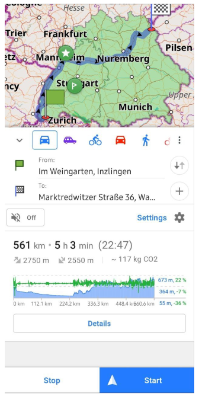

## Navigation settings for Developers

Initially, activating the [Development plugin](https://osmand.net/docs/user/plugins/development) is required.

Navigate through _Menu → Settings → App profile → Navigation settings → Route parameters → Development_:
- _Routing type_: Select the engine and algorithm for routing.
- _GPX approximation_: Opt for a GPX track approximation method.
- _Autozoom_: Activate autozoom for easier navigation.
- _OsmAnd live data_: Utilize the [most recent map updates](https://osmand.net/docs/user/personal/maps/#osmand-live) for routing.

## Speedometer

Introduced a new distinctive widget called Speedometer:

Go to _Menu → Configure screen → Other → Speedometer_

Within this section, you can select the size (_small, medium, large_) of the Speedometer and specify when to receive a Speed limit warning (_Always, When exceeded_).

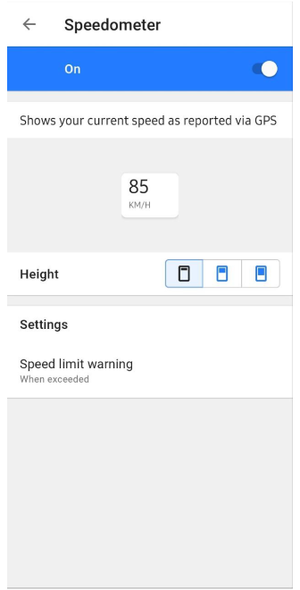 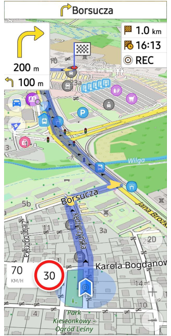

### Speedometer for Android Auto

Speedometer was added for Android Auto too.

## Round up numbers

Select the format for displaying distance information in navigation widgets (such as distance to a point, the next turn, and lanes). Opt for _"Precise"_ for exact figures, or choose _"Round up"_ for simpler readability:

_Menu → Settings → Navigation Profile → General settings → Units & formats → Distance during navigation → Precise_ or _Round up_

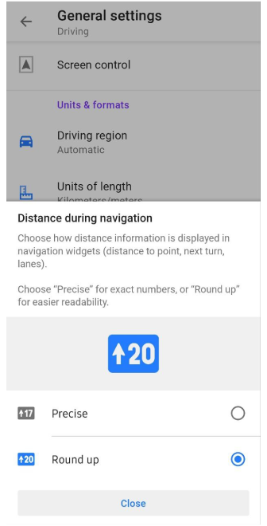 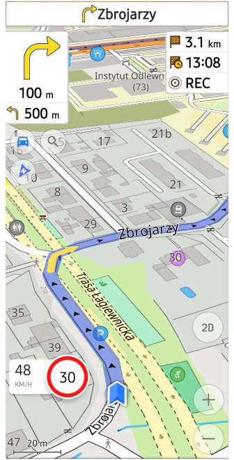

## Custom Buttons

In this update, we've introduced Custom Buttons, a unique type of [Quick action](https://osmand.net/docs/user/widgets/quick-action) tool. This means users can now create a custom action button for their device's screen.

_Menu → Configure screen → Buttons → Custom buttons → + → Add button_

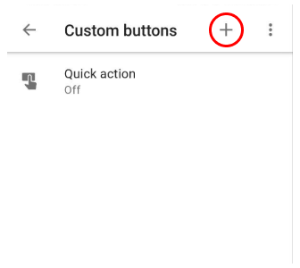 
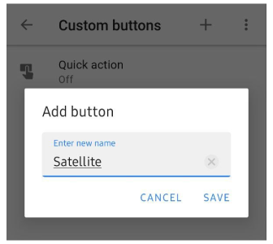

Next, you have the option to assign one or more actions to the custom button you've created and activate it.

 

Now, the new custom button will be visible on your device's screen. Tapping this button instantly toggles the selected action on or off.

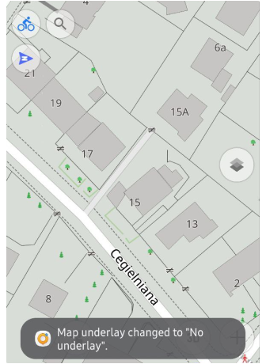

## Routes tags

Extracted [Route](https://osmand.net/docs/user/map/tracks-on-map#routes-on-the-map) Tags from [OpenStreetMap data](https://wiki.openstreetmap.org/wiki/Relation:route) Data for [Track Context menu](https://osmand.net/docs/user/map/track-context-menu#description-and-info): Includes distance, direction, state, color, roundtrip, tourism, description, type, start/end points, and elevation change (descent/ascent).

Example of relation tags for ["CAIOSM - Emilia Romagna - sentiero 137"](https://www.openstreetmap.org/relation/16115660):

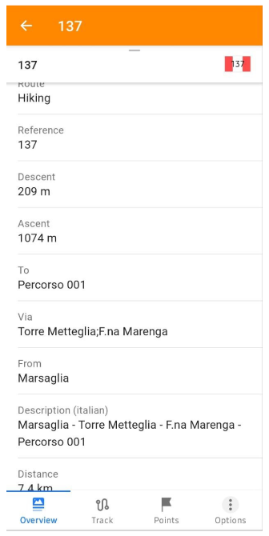

## 3D track visualization

Added 3D visialization for tracks by altitude:

_[Track Context menu](https://osmand.net/docs/user/map/tracks-on-map#track-appearance) → Change Appearance → 3D visualization_

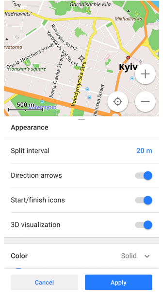 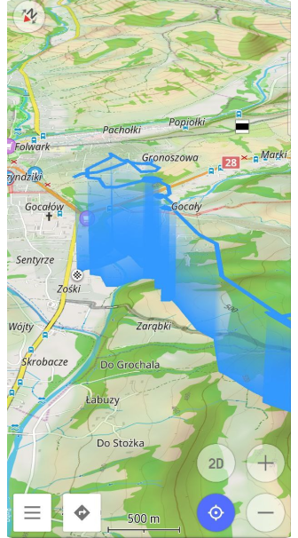

## Battery optimization dialogue

A "Battery Optimization" banner has been introduced in the [Trip recording plugin settings](https://osmand.net/docs/user/plugins/trip-recording#recording-settings). By clicking on it, you can adjust battery optimization settings, which may lead to gaps and inaccuracies in the recorded tracks:

_Menu → Settings → App Profile → Trip recoding → Read more (Android battry optimization)_

 

## Redesign graphs

[Elevation graphs](https://osmand.net/docs/user/plan-route/create-route#graph) have been revamped to eliminate overlapping labels:

## OAuth 2.0 for OSM login

Updated the OpenStreetMap login process to use OAuth 2.0 for the [_OpenStreetMap editing plugin_](https://osmand.net/docs/user/plugins/osm-editing#settings):

"The Operations Working Group is shutting down OAuth 1.0a and HTTP Basic Auth in 2024. They have been deprecated since 2023 and their role in authorization has replaced by OAuth 2.0 which the standard authorization method for most systems."

## Tracks menu

- Organization of subfolders (_My Places_ menu):

You can now apply a sorting order across all subfolders:

_Menu → My places → Tracks → &#8942; → Sort subfolders_

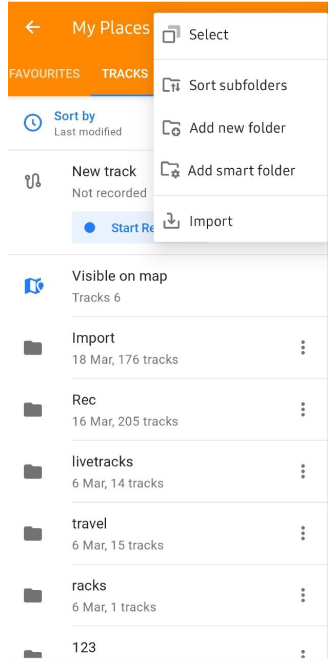 

- New Selected Tracks screen (Plan a route, Navigation, Markers, Development, Quick action):

_Navigation → Follow track → Select_

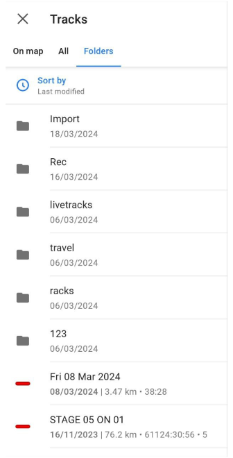

## Filter by Sensor data

Introduced the ability to [filter](https://osmand.net/docs/user/personal/tracks.md#filter) GPX tracks by sensor data.

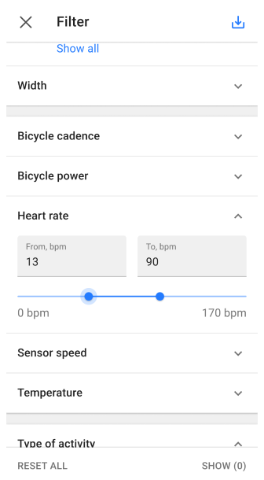

## Tags support

- The import process for GPX files now includes support for [for tags](https://github.com/osmandapp/OsmAnd/issues/18342) such as _author, cmt, link, keywords, copyright, email_ , allowing for the display of this information in the Track Context menu.

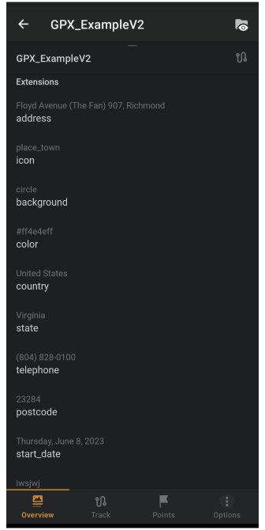

- Move sensors tags to _gpxtpx:TrackPointExtensio_.

## More

- [Reduced 2.5D tilt](https://github.com/osmandapp/OsmAnd/issues/16027) angle at low zoom levels.
- [Map tilt angle](https://github.com/osmandapp/OsmAnd/issues/18798) saved by taping on a button.
<!--- Added option of [Auto Sync](https://osmand.net/docs/user/personal/osmand-cloud) for OsmAnd Cloud.-->
- Updated [Search screen of Android Auto](https://github.com/osmandapp/OsmAnd/issues/17209).
- Added POI's [category "Water"](https://github.com/osmandapp/OsmAnd/issues/16021).
- Introduce map [rotation North fixed](https://github.com/osmandapp/OsmAnd/issues/17086).
- [Added visual border](https://github.com/osmandapp/OsmAnd/issues/14486) of downloading area ([Online maps](https://osmand.net/docs/user/map/raster-maps#download--update-tiles)) to square.
- Changed map zoom after [searching for POIs' categories](https://github.com/osmandapp/OsmAnd/issues/18901).
- [Do not switch profile](https://github.com/osmandapp/OsmAnd/issues/19166) during initial Route calculation.
- Added [Android Location services](https://osmand.net/docs/user/plugins/osmand-tracker#position) for OsmAnd Tracker. [Fixed _OsmAnd Tracker widget_](https://github.com/osmandapp/OsmAnd/issues/18235).
