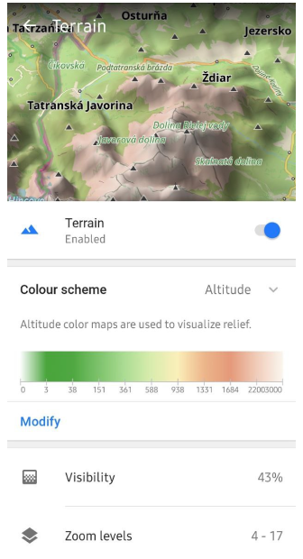
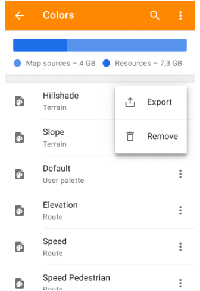
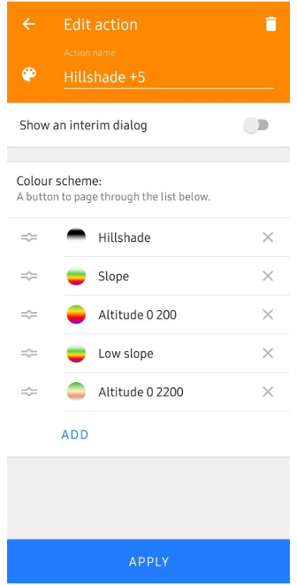
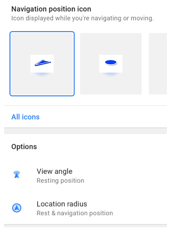
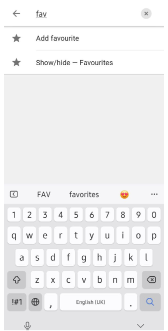
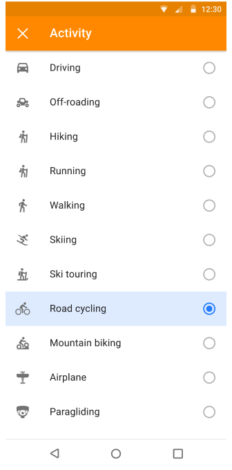

import Tabs from '@theme/Tabs';
import TabItem from '@theme/TabItem';
import AndroidStore from '@site/src/components/buttons/AndroidStore.mdx';
import AppleStore from '@site/src/components/buttons/AppleStore.mdx';
import LinksTelegram from '@site/src/components/_linksTelegram.mdx';
import LinksSocial from '@site/src/components/_linksSocialNetworks.mdx';
import Translate from '@site/src/components/Translate.js';
import InfoIncompleteArticle from '@site/src/components/_infoIncompleteArticle.mdx';
import ProFeature from '@site/src/components/buttons/ProFeature.mdx';
import InfoAndroidOnly from '@site/src/components/_infoAndroidOnly.mdx';  


# Android 4.8 (beta)

Android 4.8 is the latest release that introduces many new features and improvements to the OsmAnd app. This article describes all the key updates that represent meaningful changes for our users. 

# Join Beta

OsmAnd releases several Ready-To-Use builds daily, allowing you to track new features and participate in the OsmAnd translation process. You can take part in testing the beta version of OsmAnd using Google Play.

<div class="button-row">
  <a class="button button--active" href="https://play.google.com/apps/testing/net.osmand.plus">OsmAnd+</a>
  <a class="button button--active" href="https://play.google.com/apps/testing/net.osmand">OsmAnd</a>
</div>  

<br/>

# What's new

- [Altitude](#altitude-of-terrain-color-scheme) terrain colorization option.
- [Color schemes](#color-schemes) for terrain, tracks, and routes.
  - [Custom Color palettes](#custom-color-palettes).
  - [Quick action button](#quick-action-to-switch-terrain-color-palettes) for terrain color scheme.
  - [The map legend for color palette schemes](#map-legend-for-color-palette-schemes) of tracks, routes, and terrain.
- [Profile appearance redesign](#profile-appearance-redesign).
- [3D options](#3d-my-location-icons) for My location icons.  
- The new [Add action screen](#quick-actions-tool-update) of the Quick Actions tool has been updated.
  - [Show / Hide actions](#show-or-hide-routes-on-the-map) for Routes on the map.  
  - Quick Actions on the [external keyboard](#quick-actions-to-external-keyboard) allow you to assign actions for personalized use.
- [Weather UI](#weather-tool-improvements) has been updated with layer animations and improved label visibility.
- Improvements for the [3D track view](#3d-track-improvements).
- [Detailed track guidance](#update-attach-to-the-roads) for Attach to the roads.
- Removed login/password authorization method in [OpenStreetMap Editing plugin](#login-to-openstreetmap).
- [More icons](#more-favorite-icons) for Favorites.
- Added [Water category of POIs](#water-category-of-pois).
- Updates for [Compass button](#compass-button-updates).
- [Optional updates](#optional-updates).


## Altitude of Terrain Color Scheme



The feature displays the altitude of the terrain in different colors, which greatly improves the visual perception of the map. Easily recognizable different altitude levels with [new color palette](../user/plugins/contour-lines.md#terrain) helps you better navigate the terrain and distinguish uplands from lowlands.  


## Color Schemes

New color palette schemes have been added.
- For [routes](../user/navigation/guidance/map-during-navigation.md#color): *Speed, Slope,* and *Elevation (Altitude)*.
- For [terrain](../user/plugins/contour-lines.md#hillshade-slope-and-altitude-layers): *Hillshade, Slope*, and *Altitude*.
- For [weather](../user/plugins/weather.md#weather-layers): *All weather layers*.

Color palette data is available in the [_Maps & Resources_](../user/personal/maps.md#local) menu.

*Menu → Maps & Resources → Local → Colors*




## Custom Color Palettes


You can add your custom color palettes to OsmAnd. To do this, create a TXT file with the required name:
- *Routes*: `route_speed_name.txt`, `route_slope_default.txt`, `route_elevation_default.txt`.
- *Terrain*: `height_altitude_name.txt`, `hillshade_color_name.txt`, `slope_name.txt`.
- *Weather*: `weather_name.txt`.

For example:

```
TXT file named *height_altitude_0-200.txt*

# 0 - 90 degree RGBA
0,46,185,0,191
# yellow 
100,255,222,2,227
# red
200,255,1,1,255
# violet
220,130,1,255,255

```
After moving this TXT file to *..Android/data/net.osmand/files/color-palete/height_altitude_0-200.txt*, a new palette will appear in the Color Scheme menu.


<!--
### Palette Editor

_Terrain → Modify (Colour scheme) → All colors → &#8942; → Edit_

<table class="image">
    <tr>
        <td></td>
        <td></td>
    </tr>
</table>  

The palette editor allows you to create and edit custom color schemes to personalize your maps. This is where you can customize colors according to personal preferences or the requirements of a particular route. 
-->

### Quick Action to Switch Terrain Color Palettes

*Menu → Configure screen → Custom buttons → + → Add button → Add action → Topography → Change Terrain color scheme*  



In this release, we have added the ability to switch between [terrain](../user/plugins/contour-lines.md#terrain) color palettes, similar to switching between layers. This can be done using the Quick Actions tool.  

### Map Legend for Color Palette Schemes

<table class="image">
    <tr>
        <td></td>
        <td></td>
        <td></td>
    </tr>
</table>  

The legend provides an easy way to view and understand the different markings on the map. New color palette schemes have been added to display [**speed** for tracks](../user/map/tracks/index.md#track-appearance), [**line type** for routes](../user/navigation/guidance/map-during-navigation.md#color), [**altitude and slope** for terrain](../user/plugins/contour-lines.md#color-scheme), and all [**weather layer**](../user/plugins/weather.md#weather-layers) color palettes.


## Profile Appearance Redesign



The [appearance of profiles](../user/personal/profiles.md#profile-appearance) has been improved to make them more interesting, recognizable, and usable. 

The update includes:
- New icon and color selection components.
- Redesign of the location icon selection map.
- Default [3D icons](#3d-my-location-icons) for [map rendering Version 2 (OpenGL)](../user/personal/global-settings.md#map-rendering-engine).
- Added *Options* menu for 3D icons:
  - **View angle**. Status: *Off*, &nbsp;*Resting position*, &nbsp;*Navigation position*, &nbsp;*Rest & navigation position*.  
  Displays of the cone-shaped area you are currently in.
  - **Location radius**. Status: *Off*, &nbsp;*Resting position*, &nbsp;*Navigation position*, &nbsp;*Rest & navigation position*.  
  Displays a circular area that reflects the accuracy of your current location.  


## 3D My Location Icons


A new 3D view has been added for [My Location](../user/personal/profiles.md#profile-appearance) icons, which improves their visualization on the map. These changes bring the appearance of the icons in alignment with the 3D tilt of the map.  

3D icons are only available for [map rendering Version 2 (OpenGL)](../user/personal/global-settings.md#map-rendering-engine).


## Quick Actions Tool Update

 

The updated **Add Action** screen makes it easier to customize and add [*Quick actions*](../user/widgets/quick-action.md), improving access to important features. You can now find groups of actions, use the search function, and apply other actions to customize the *Quick Actions tool*, contributing to a better user experience.

### Show or Hide Routes on the Map

Added a new quick action *Show/Hide [Routes on the map](../user/map/vector-maps.md#routes)*. Now you can turn on or off routes on the map with one tap.

### Quick Actions to External Keyboard

 

You can now assign all Quick Actions to [external keyboard buttons](../user/map/interact-with-map.md#settings). This is especially useful if you often work with the application using external input devices and need quick access to basic functions. The ability to customize quick actions in this way makes working with OsmAnd more flexible and efficient.  


## Weather Tool Improvements


Layer animations and improved labels make the weather interface more visual and informative. These changes help you better understand current weather conditions and forecasts. Improved label visibility makes navigating weather data much easier.  

**Improvements**:
- **New weather panel** with an updated user interface.

<!--

Additional **Weather source options**.
  - Tap the ⚙ icon and select [GFS](https://en.wikipedia.org/wiki/Global_Forecast_System) or [ECMWF](https://en.wikipedia.org/wiki/European_Centre_for_Medium-Range_Weather_Forecasts).
-->

- **Weather animation**.
  - After making sure the weather layers are selected, tap the *Play* button on the *Weather* screen.
  
- A **Wind animation layer** has been added.


## 3D Track Improvements


Updated 3D track visualizations provide a more detailed view of routes.  In this release, we have added the following improvements to the [3D track appearance](../user/map/tracks/index.md#track-appearance). 

1. **Visualization options.** 
    - If *Visualized by* is set to *Fixed height*,  
        *→* change *Vertical exaggeration* to *Wall height*.

2. **Wall color options.** 
    - You can choose from:  
        *Solid, Downward gradient, Upward gradient, Altitude, Slope,* or *Speed*.


## Attach to the Roads Update

*[Navigation settings](../user/navigation/guidance/navigation-settings) → Other → Detailed track guidance*  

  

A new Detailed track guidance setting has been added for the [*Attach to the roads*](../user/navigation/setup/gpx-navigation.md#attach-to-the-roads) feature. The options for using the feature are:
- **Ask every time**. The button is always displayed when you create a route using *Follow track* in the Navigation menu.
- **Always**. Attach to the roads is applied automatically.


<!--
## GPX Track Acitivity



The new feature of adding **Activity** to a recorded GPX track improves navigation and track management. This increases the convenience of working with track recordings.
-->


## Login to OpenStreetMap


To improve security, the option to authorize via login and password has been removed. As of June 1, 2024, only the new secure OAuth 2.0 method will be supported.  This authorization method provides a higher level of information security to help protect your data and prevent unauthorized access.

The Use username and password button has been removed from: 

- *Login to* screen in the OSM Editing plugin menu.
- Benefits for active OSM contributors. 
- Upload OSM Note dialog.


## More Favorite Icons


A complete list of [icons for Favorites](../user/personal/favorites.md#create-and-edit) has been added, which helps to organize and visualize them better. This allows you to search and select an icon for a favorite in a *Сustom POI search* from the icon library, making the use of favorites more convenient and efficient.  


## Water Category of POIs


The new POI [Water (Man made)](https://github.com/osmandapp/OsmAnd/issues/16021) category includes objects with drinking water sources. Searching this [сategories](../user/search/search-poi.md#categories-poi-search) will help you easily find water on the map when traveling.  


## Compass Button Updates

The compass button has received updates that improve its functionality. These changes make the compass more accurate and easier to use, and help you navigate better.

[**Compass button**](../user/map/interact-with-map.md#map-orientation-and-compass): 

- **Single tap**. Rotates the map orientation to the North in all orientations. Even if it rotates back in a second, such as in compass mode.
- **Double tap**. Switches map orientations. This previously worked with a single tap.
- **Long tap**. Opens a bottom sheet with a list of available orientations. This function remains unchanged.

**Processed accessibility actions**: 

- **Single tap**. Rotates the map to the North in main mode.  
    *→* This action corresponds to a **Double tap** in *TalkBack*.
- **Long tap**. Opens the bottom sheet with orientations in main mode.  
    *→* This action corresponds to a **Double tap and hold** in *TalkBack*.
- **Double tap** to switch map orientation is not available in Accessibility mode.


## Optional Updates

- Significant speed improvement for [Attach to roads](../user/navigation/setup/gpx-navigation.md#attach-to-roads) algorithm.

- Added [Pale style](https://github.com/osmandapp/OsmAnd/issues/20208) for roads rendering.

- *Stair icon* was added to the map at border nodes.

- Added *Energy and Rendering statistics* to the Development plugin.

- Added [Brands](https://github.com/osmandapp/OsmAnd/issues/20256) for POIs categories.

- Improved colors for [multiple GPX tracks after import](https://github.com/osmandapp/OsmAnd/issues/19995).

- Updated detailed [Sharing text](../user/map/map-context-menu.md#share) screen for Android 14.

- Using [localized names](https://github.com/osmandapp/OsmAnd/issues/20020) for routes.

- Fixed: 

  - Bug with [export-import of GPX files](https://github.com/osmandapp/OsmAnd/issues/19212).

  - [Incrorrect labeling](https://github.com/osmandapp/OsmAnd/issues/19834) of external temperature sensor data for GPX files.

  - An issue with [navigation not stopping after reconnecting in Android Auto](https://github.com/osmandapp/OsmAnd/issues/19651).

  - [Incorrect instructions during navigation in Android Auto](https://github.com/osmandapp/OsmAnd/issues/19438).

  - [Sorting (statistics and search) of tracks folders in *Configure map → Tracks*](https://github.com/osmandapp/OsmAnd/issues/19634).

  - Bug with [3D mode button tilt angle](https://github.com/osmandapp/OsmAnd/issues/19868) on the map.

  - [Incorrect calculation of uphil](https://github.com/osmandapp/OsmAnd/issues/20074).

  - [Wrong elevation data on graph](https://github.com/osmandapp/OsmAnd/issues/19142) for tunnels, bridges in Route details.

  - [Bug with copied "Custom button"](https://github.com/osmandapp/OsmAnd/issues/19767) from another profile.

  - [Bug with malfunction](https://github.com/osmandapp/OsmAnd/issues/20254) when displaying Quick Action names.

  - [Bug with not moving contact icon](https://github.com/osmandapp/OsmAnd/issues/19176) sharing of OsmAnd Telegram tracker.

  - Bug with icons sizes on [Samsung DeX](https://www.samsung.com/uk/apps/samsung-dex/).
