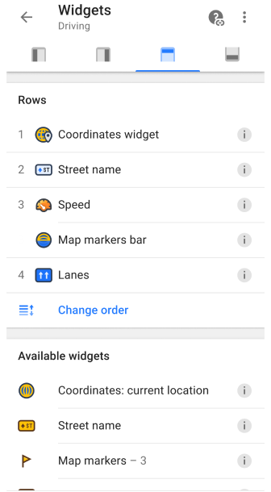
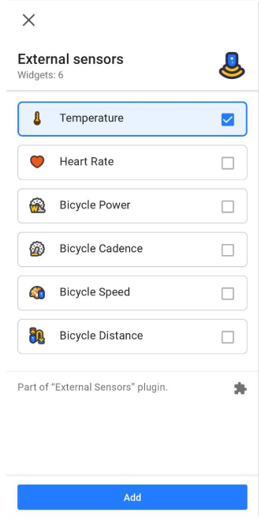
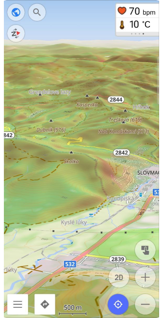
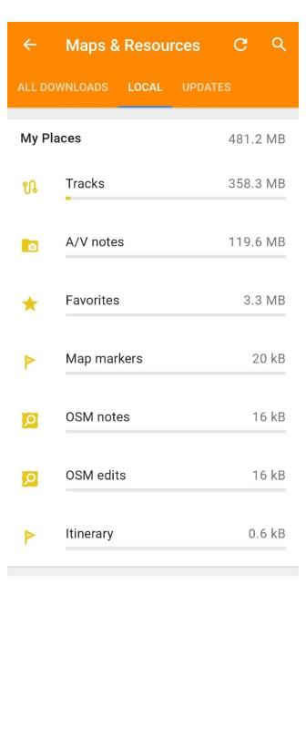
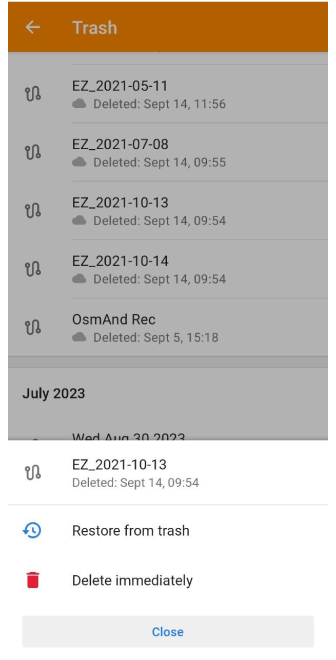
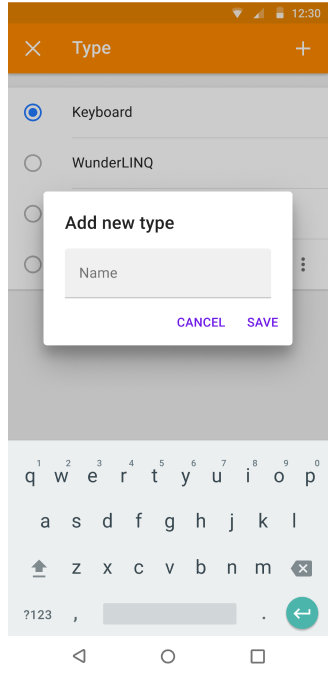

import Tabs from '@theme/Tabs';
import TabItem from '@theme/TabItem';
import AndroidStore from '@site/src/components/buttons/AndroidStore.mdx';
import AppleStore from '@site/src/components/buttons/AppleStore.mdx';
import LinksTelegram from '@site/src/components/_linksTelegram.mdx';
import LinksSocial from '@site/src/components/_linksSocialNetworks.mdx';
import Translate from '@site/src/components/Translate.js';
import InfoIncompleteArticle from '@site/src/components/_infoIncompleteArticle.mdx';
import ProFeature from '@site/src/components/buttons/ProFeature.mdx';
import InfoAndroidOnly from '@site/src/components/_infoAndroidOnly.mdx';  

# Android 4.6 (beta)

Android 4.6 is the latest release that introduces many new features and improvements to the OsmAnd app. This article describes all the key updates that represent meaningful changes for our users.

## Join Beta

OsmAnd releases several Ready-To-Use builds daily, allowing you to track new features and participate in the OsmAnd translation process. You can take part in testing the beta version of OsmAnd using Google Play.

  <a class="button button--active" href="https://play.google.com/apps/testing/net.osmand.plus">OsmAnd+</a>
  <a class="button button--active" href="https://play.google.com/apps/testing/net.osmand">OsmAnd</a>

## What's new

- [Update widgets](#widgets-update):
    - Updates for [Top/Bottom panels](#updates-for-topbottom-panels) in the Configure screen menu.
    - Added [Glide Ratio](#glide-ratio-widget) Widget.
    - Added [Temperature widget](#ant-temperature-widget) for External sensors.
- New [Local tab](#local-menu-redesign) in Maps & Resources menu.
- Added a new option to create and customize [Smart Folder](#smart-folders) in the *Tracks* tab of the *My Places* menu. 
- [Filters](#filters-for-tracks-search) for Tracks search.
- Adding a [screen Trash](#trash-feature-in-osmand-cloud) to view and manage files deleted from OsmAnd Cloud.
- New [Help screen](#help-screen) with offline support.
- [Redesigned Weather screen](#redesign-weather-screen).
- Added share [point coordinates](#share-point-coordinates-by-an-osm-link) by OSM link.
- [Custom actions](#custom-actions-for-external-controller-buttons) for external controller buttons.
- Updates to [Plan a route](#updates-to-plan-a-route-tool) tool.
- [Additional](#more-updates-in-this-release) updates in this release.

## Update widgets

With the new release, it is now possible to add all widgets to the Top/Bottom panels in the Configure screen menu. Added Glide Ratio widget and Temperature widget for external sensors, providing additional data and usability of the application.

### Top/Bottom panels

Our top and bottom panels have been redesigned with all our users' needs in mind. Now you can customize the widgets on your home screen the way you want, giving you more freedom to display important data.  

**1.** Added ability to add and remove rows for *Top / Bottom panel*. 

*OsmAnd menu → Configure screen → Widgets → Edit → [Add row](../user/widgets/configure-screen.md#rows-for-panels)*

| View mode  | Edit mode   |
|-----|------|
|  |  |

**2.** Added support to change [widget size](../user/widgets/configure-screen.md#settings). You can choose the size that best suits your needs: *Small, Medium, Large*.  

  

**3.** You have the ability to add more than one [Simple widget](../user/widgets/configure-screen.md#rows-for-panels) in a single row.

|  |
|-----|
|  |

### Glide Ratio Widget

*<Translate android="true" ids="shared_string_menu,map_widget_config,shared_string_widgets"/> → Any panels → Glide ratio → [Glide ratio to target](../user/widgets/info-widgets.md#glide-ratio)* and [*Average glide ratio*](../user/widgets/info-widgets.md#glide-ratio) 

  

The Glide Ratio widget is an innovative tool designed to meet the needs of pilots. The widget provides valuable glide ratio information to help make informed decisions when planning air routes.  

<<<<<<< HEAD
Simple *[Glide Ration](https://en.wikipedia.org/wiki/Lift-to-drag_ratio#Glide_ratio)* widgets have been added for Aircraft usage. The widgets show the ratio of glide to target or average glide for the current flight.  

- *Glide ratio to target* shows the glide ration required to reach the target point. The [Map marker](../user/personal/markers.md) should be used as the target point. 
- *Average glide ratio* shows the average glide ratio for a specified time interval. You can set the time interval for this widget from 15 seconds to 60 minutes.
=======
Simple *[Glide Ratio](https://en.wikipedia.org/wiki/Lift-to-drag_ratio#Glide_ratio)* widgets were added for Aircraft usage. Widgets show the glide ratio to the target or avearge glide for the current trip:

- *Glide ratio to target* shows the glide ratio needed to reach the target point. You need to use [Map marker](https://osmand.net/docs/user/personal/markers) as a target point.
- *Average glide ratio* shows the average glide ratio for the set interval. For this widget you can specify the time interval for glide averaging.
>>>>>>> a83949ad3750f092373edee47c49ea6d0ad221e8

| Glide ratio widgets | Widgets on the screen |
|--------|---------|
|  |  |

### ANT+ Temperature widget

We have added a new widget for the [External sensor plugin](../user/plugins/external-sensors.md#overview). **<Translate android="true" ids="external_device_characteristic_temperature"/>** widget displays the ambient temperature, which can be very useful if you don't want to overheat or freeze on your bike or motorcycle.  
- Read more about how to connect sensors to OsmAnd app [here](../user/plugins/external-sensors.md#setup).   
- Next you need [to add the temperature widget](../user/widgets/info-widgets.md#external-sensors-widgets) to the OsmAnd screen:  
*<Translate android="true" ids="shared_string_menu,layer_map_appearance"/> → [Any panels](../user/widgets/configure-screen.md#top--bottom-panel-widgets) → <Translate android="true" ids="external_sensor_widgets"/>*  

|   |   |
|--------|---------|
|||

## Local menu redesign

When working with maps, additional resources are always important. Android 4.6 redesigns the *Local* tab in the *Maps & Resources* menu, making access to local maps and data more convenient and, with new graphs, more visual.  

The **Local** menu now contains all necessary additional information about the OsmAnd data:    
*Menu → Download maps (Maps & Resources) → Local*

- **Resources**: *Standart Maps, Terrain maps, Wikipedia and Travel maps, Nautical Maps, Weather, Map sources, Rendering styles, Routing, Cache*.
- **My Places**: *Favorites, Tracks, OSM Notes, OSM Edits, A/V Notes, Map markers, History, Itinerary*.
- **Settings**:
  - *Other*. Data that does not fit into other categories, such as logcat.
  - *Profiles*. All settings for created profiles and default profiles.

| Resources  | My places  |  Settings   |
|--------|---------|---------|
||||  

You can select any item from the main list of categories on the Local tab, tap it, and go to a screen with a detailed list of that item and additional options.  

| Terrain maps  | Tracks  |
|--------|---------|
|||

## Smart folders

The new [*Smart Folder*](../user/personal/tracks.md#smart-folder) feature in the Tracks menu provides additional options for organizing tracks. This feature automatically sorts tracks according to the specified filter parameters and provides advanced settings to manage them.  

*Smart Folder* allows you to specify a set of parameters for GPX tracks to be contained in a folder, making it even easier to keep track of files.    
*OsmAnd menu → My Places → Tracks → &#8942; → Add smart folder*

| Tracks menu  | Settings  |
|--------|---------|
|||

## Filters for Tracks search

[Filter](../user/personal/tracks.md#filter) for tracks can be used for tracks Search function and for Smart folders.  

- *OsmAnd menu → My Places → Tracks → 🔍 → Filter*
- *OsmAnd menu → My Places → Smart folder → Filter*

   

In addition to navigation and track creation, the Osmand app provides handy tools for managing your track recordings. With the latest update to the app, new features have been added to the Tracks section to better search and filter your tracks. These new filters provide more detailed and customizable options to search for tracks based on various parameters, allowing you to quickly find tracks that meet your specific requirements and preferences.   

**Filters**: *Duration, Time in motion, Length, Average speed, Uphill, Downhill, Average altitude, Max altitude, Date of creation, Nearest cities, Other*.

| Search menu | Filter menu |
|--------|---------|
|||

## Trash feature in OsmAnd Cloud

[Trash](../user/personal/osmand-cloud.md#trash) feature has been added for OsmAnd Cloud:  
*OsmAnd menu → Settings → OsmAnd Cloud → Trash*

With the *Trash* feature, you can easily view and restore files deleted from OsmAnd Cloud. This allows you to gain more control over your data and avoid accidental irreversible deletion.  

- *Empty trash* button deletes all items. 
- **Items in trash will be erased after 30 days**.

| OsmAnd Cloud menu| Trash menu|
|-------|-------|
|||

- Each item from Trash can be *Restore* or *Delete*. 

| Item's acitons|
|-------|
||

## Help screen

*<Translate android="true" ids="shared_string_menu,shared_string_help"/>*

  

This is an important new feature for users who often travel in regions with limited internet access. The application now has an offline (saved to cache) help screen that helps you solve questions and find information without a network connection.  

In addition, the Help menu has been completely redesigned, adding articles from [www.osmand.net/docs](https://osmand.net/docs/intro/) with additional menu sections:  

*Most viewed*, [*User guide*](https://osmand.net/docs/user/), [*Troubleshooting*](https://osmand.net/docs/user/troubleshooting/), *Contact us*, *Report issues*, *About OsmAnd*.

| | |
|-------|-------|
|||

## Redesign weather screen

The [Weather](../user/plugins/weather.md) screen has been redesigned and improved, allowing users to get more accurate and up-to-date weather information on their route, such as a time scale. This is useful when planning trips and choosing the right time for outdoor activities.  

| |
|-------|
||

## Share point coordinates by an OSM link

Now in the Context menu of a point, you can find not only geographical coordinates in different formats but also a shareable [OpenStreetMap Link with a location marker](https://wiki.openstreetmap.org/wiki/Browsing#Adding_a_Marker). This makes it easier to travel together and share information with other users.   

| | |
|-------|-------|
| ||

## Custom actions for external controller buttons

You now have the ability to customize actions for buttons or custom buttons for [External controllers](../user/map/interact-with-map.md#external-input-device-buttons). This allows you to customize the control of the application according to your preferences and makes it easier to use OsmAnd in different situations.  

*Menu → Settings → Profiles → General settings → External input devices*

- Select external input devices, such as a Keyboard, and create a Key binding.

| Add new type| Add key binding|
|-------|-------|
| ||

- Additional Actions and Map iterations for key binding are also available.  

| Key bindings|
|-------|
| |

## Update in Plan a route tool

The *Import from Track* feature allows you to import waypoints, segments, and additional data from any other existing track into the current track.

*[Plan a route](https://osmand.net/docs/user/plan-route/create-route) →  Options → Import from track*

| Options menu|
|-------|
| |

<<<<<<< HEAD
## More updates in this release

The new release also contains a number of other significant updates:  

- Improved memory management for large GPX tracks for smoother operation when working with large files.
- The [OpenPlaceReviews](../user/plugins/openplacereviews.md) project has been permanently finalized and is only available now up to Android 4.5. 
- Updated the *Search screen* for Android Auto, which improves the user experience with the app in the car.
- Fixed map freezing for Android Auto, improving the stability of the app.
- Renamed the *Terrain* menu to [*Topography*](../user/plugins/contour-lines.md#configure-map-view) for better understanding and matching terminology.
- Added *Select All* and *Deselect All* actions to the [Track menu](../user/personal/tracks.md#my-places-menu) to provide more options for data management.
- Fixed *North fix* mode for [Compass](../user/map/interact-with-map.md#map-orientation-modes) to improve navigation accuracy.
- Added *Available RAM* widget for [OsmAnd Development plugin](../user/plugins/development.md), providing users with more accurate information about device resources and allowing to control memory usage.
- [Icons](../user/personal/profiles.md#profile-appearance) for paraglider, baby carriage, stroller, and buggy stroller have been added to the Profiles, making the profile appearance more informative and diverse.
- When [_Destination is reached_](../user/navigation/guidance/map-during-navigation.md) appears, the location is moved to the center of the map for the user's convenience.

The release of the OsmAnd app for Android 4.6 offers users a wide range of improvements, new features, more powerful navigation and data management tools, making the use of the app more convenient, informative and adapted to different usage situations.  
=======
## Redesign weather screen

Added the convenient time scale.

| |
|-------|
||

## More

- Improved memory management for large GPX tracks
- Shutdown [the OpenPlaceReviews project](https://osmand.net/docs/user/plugins/openplacereviews)
- Updated Search screen for Android Auto
- Fixed map freezes for Android Auto
- Renamed _Terrain_ to [_Topography_](https://osmand.net/docs/user/plugins/contour-lines#configure-map-view) menu
- _Select all_ / _Deselect all_ actions for [Track menu](https://osmand.net/docs/user/personal/tracks#my-places-menu)
- Fixed _North fixed_ mode for [Compass](https://osmand.net/docs/user/map/interact-with-map#map-orientation-modes)
- Added widget _Available RAM_ for [OsmAnd Development plugin](https://osmand.net/docs/user/plugins/development)
- Added paragliding / baby carriage / stroller / buggy [icons](https://osmand.net/docs/user/personal/profiles#profile-appearance) for profiles
- Added [ANT+ temperature widget](https://osmand.net/docs/user/plugins/external-sensors) for Garmin temperature sensor device
- [_"Destination is reached"_](https://osmand.net/docs/user/navigation/guidance/map-during-navigation), the location moves to map center
>>>>>>> a83949ad3750f092373edee47c49ea6d0ad221e8
