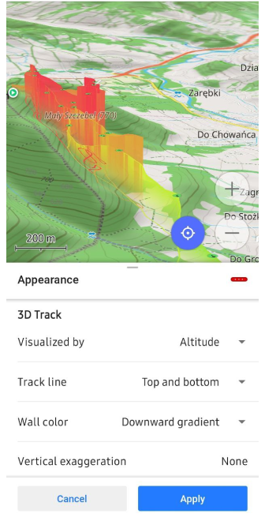
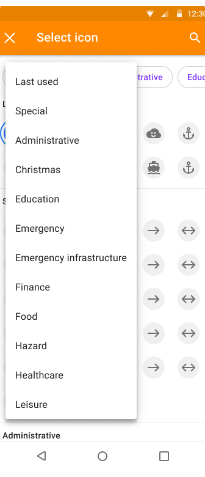
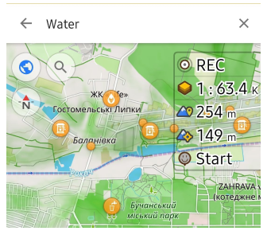

import Tabs from '@theme/Tabs';
import TabItem from '@theme/TabItem';
import AndroidStore from '@site/src/components/buttons/AndroidStore.mdx';
import AppleStore from '@site/src/components/buttons/AppleStore.mdx';
import LinksTelegram from '@site/src/components/_linksTelegram.mdx';
import LinksSocial from '@site/src/components/_linksSocialNetworks.mdx';
import Translate from '@site/src/components/Translate.js';
import InfoIncompleteArticle from '@site/src/components/_infoIncompleteArticle.mdx';
import ProFeature from '@site/src/components/buttons/ProFeature.mdx';
import InfoAndroidOnly from '@site/src/components/_infoAndroidOnly.mdx';  


# Android 4.8 (beta)

Android 4.8 is the latest release that introduces many new features and improvements to the OsmAnd app. This article describes all the key updates that represent meaningful changes for our users. 

# Join Beta

OsmAnd releases several Ready-To-Use builds daily, allowing you to track new features and participate in the OsmAnd translation process. You can take part in testing the beta version of OsmAnd using Google Play.

<div class="button-row">
  <a class="button button--active" href="https://play.google.com/apps/testing/net.osmand.plus">OsmAnd+</a>
  <a class="button button--active" href="https://play.google.com/apps/testing/net.osmand">OsmAnd</a>
</div>  

<br/>

# What's new

- [Altitude](#altitude-color-scheme-for-terrain) terrain colorization option.
- [Custom color palettes](#custom-color-palettes) for terrain, tracks, and routes:
  - [Palette editor](#palette-editor).
  - [Quick action button](#quick-action-to-change-the-color-scheme-of-the-terrain) for Terrain color schemes.
  - [Color palette legend](#color-palette-legend) for tracks, routes, and terrain.
- [3D options](#3d-my-location-icons) for My location icons. 
- [Profile appearance redesign](#profile-appearance-redesign).
- [Add action screen](#quick-actions-tool-update) of the Quick Actions tool.
  - Quick Actions to the [external keyboard](#quick-actions-to-external-keyboard) allow you to assign actions for personalized use.
- [Weather UI](#weather-tool-improvements) has been updated with layer animations and improved label visibility.
- Improvements for the [3D track view](#3d-track-improvements).
- [GPX track activity](#gpx-track-activity).
- Removed login/password authorization method in [OpenStreetMap Editing plugin](#login-to-openstreetmap).
- [More icons](#more-favorite-icons) for Favorites.
- Added [Water category of POIs](#water-category-of-pois).
- Updates for [Compass button](#compass-button-updates).
- [Optional updates](#optional-updates).


## Altitude Color Scheme for Terrain


The feature displays the altitude of the terrain in different colors, which greatly improves the visual perception of the map. Easily recognizable different altitude levels with [new color scheme](../user/plugins/contour-lines.md#terrain) helps you better navigate the terrain and distinguish uplands from lowlands.  


## Custom Color Palettes


New colorizations of color palette schemes have been added for:
- [Route](https://osmand.net/docs/user/navigation/guidance/map-during-navigation#color): Speed, Slope, Elevation (Altitude).
- [Terrain](https://osmand.net/docs/user/plugins/contour-lines#hillshade--slope): Hillshade, Slope, Altitude.
- [Weather](https://osmand.net/docs/user/plugins/weather#weather-layers): All weather layers.

Users can create and add their own color palettes. Simply compose your TXT file with the following names: _Terrain_ - `height_altitude_name.txt`, `hillshade_color_name.txt`, `slope_name.txt`, _Routes_ - `route_speed_name.txt`, `route_slope_default.txt`, `route_elevation_default.txt`, _Weather_ - `weather_name.txt`

*height_altitude_0-200.txt*

```
# 0 - 90 degree RGBA
0,46,185,0,191
# yellow 
100,255,222,2,227
# red
200,255,1,1,255
# violet
220,130,1,255,255

```
After moving the TXT file to _..Android/data/net.osmand/files/color-paletee/height_altitude_0-200.txt_, new palettes will appear in the Colour Scheme menu.

### Palette Editor

*Terrain → Modify (Colour scheme) → All colors → &#8942; → Edit*

<table class="image">
    <tr>
        <td></td>
        <td></td>
    </tr>
</table>  

<!--
Редактор палитр: Позволяет создавать и редактировать собственные цветовые схемы для лучшей персонализации карт. Пользователи могут настроить цвета в соответствии с личными предпочтениями или требованиями определенного маршрута. Это делает навигацию более гибкой и индивидуальной.

Здесь вы можете создавать и изменять собственную палитру.
-->

Here, you can create and modify your own palette.

### Quick Action to Change the Color Scheme of the Terrain

*Menu → Configure screen → Custom buttons → + → Add button → Add action → Topography → Change Terrain color scheme*  


In this release, we have added the ability to switch between terrain color schemes, similar to switching between layers. This can be done using the Quick Actions tool.

### Color Palette Legend

<table class="image">
    <tr>
        <td></td>
        <td></td>
        <td></td>
    </tr>
</table>  

The legend provides an easy way to view and understand the different markings on the map. New color palettes have been added to display [**speed** for tracks](../user/map/tracks-on-map/track-appearance.md#color), [**line type** for routes](../user/navigation/guidance/map-during-navigation.md#color), [**altitude and slope** for terrain](../user/plugins/contour-lines.md#color-scheme), and all [**weather layer**](../user/plugins/weather.md#weather-layers) color palettes.


## 3D My location Icons


A new 3D view has been added for [My Location](../user/personal/profiles.md#profile-appearance) icons, which improves their visualization on the map. These changes bring the appearance of the icons in alignment with the 3D tilt of the map.   


## Profile Appearance Redesign

The [appearance of profiles](../user/personal/profiles.md#profile-appearance) has been improved to make them more interesting, recognizable, and usable. 
The update includes:
- New icon and color selection components.
- Redesign of the location icon selection map.
- Added options to disable location radius and viewing angle.
- Default 3D icons in OpenGL.


## Quick Actions Tool Update

   

The updated **Add Action** screen makes it easier to customize and add [*Quick actions*](../user/widgets/quick-action.md), improving access to important features. You can now find groups of actions, use the search function, and apply other actions to customize the *Quick Actions tool*, contributing to a better user experience.

### Quick Actions to External Keyboard

   

You can now assign all Quick Actions to [external keyboard buttons](../user/map/interact-with-map.md#settings). This is especially useful if you often work with the application using external input devices and need quick access to basic functions. The ability to customize quick actions in this way makes working with OsmAnd more flexible and efficient.


## Weather Tool Improvements

  

Layer animations and improved labels make the weather interface more visual and informative. These changes help you better understand current weather conditions and forecasts. Improved label visibility makes navigating weather data much easier.  

**Improvements**:
- **New weather panel** with an updated user interface.

- Additional **Weather source options**.
  - Tap the ⚙ icon and select [GFS](https://en.wikipedia.org/wiki/Global_Forecast_System) or [ECMWF](https://en.wikipedia.org/wiki/European_Centre_for_Medium-Range_Weather_Forecasts).

- **Weather animation**.
  - After making sure the weather layers are selected, tap the *Play* button on the *Weather* screen.
  
- A **Wind animation layer** has been added.


## 3D Track Improvements



Updated 3D track visualizations provide a more detailed view of routes.  In this release, we have added the following improvements to the [3D track appearance](../user/map/tracks-on-map/track-appearance.md#3d-track). 

1. **Visualization options.** 
    - If *Visualized by* is set to *Fixed height*,  
        *→* change *Vertical exaggeration* to *Wall height*.

2. **Wall color options.** 
    - You can choose from:  
        *Solid, Downward gradient, Upward gradient, Altitude, Slope,* or *Speed*.


## GPX Track Activity


The new feature of adding **Activity** to a recorded GPX track improves navigation and track management. This increases the convenience of working with track recordings.


## Login to OpenStreetMap


To improve security, the option to authorize with login and password has been removed. As of June 1, 2024, only the new secure OAuth 2.0 method will be supported. This authorization method provides a higher level of information security to help protect your data and prevent unauthorized access.

The Use username and password button has been removed from: 

- *Login to* screen in the OSM Editing plugin menu.
- Benefits for active OSM contributors. 
- Upload OSM Note dialog.


## More Favorite Icons



A complete list of [icons for Favorites](https://github.com/osmandapp/OsmAnd/issues/16223) has been added, which helps to organize and visualize them better. This allows you to search and select an icon for a favorite in a *Сustom POI search* from the icon library, making the use of favorites more convenient and efficient.  


## Water Category of POIs



The new POI [Water (Man made)](https://github.com/osmandapp/OsmAnd/issues/16021) category includes objects with drinking water sources. Searching this [сategories](../user/search/search-poi.md#categories-poi-search) will help you easily find water on the map when traveling.  


## Compass Button Updates

The compass button has received updates that improve its functionality. These changes make the compass more accurate and easier to use, and help you navigate better.

[**Compass button**](../user/map/interact-with-map.md#map-orientation-and-compass): 

- **Single tap**. Rotates the map orientation to the North in all orientations. Even if it rotates back in a second, such as in compass mode.
- **Double tap**. Switches map orientations. This previously worked with a single tap.
- **Long tap**. Opens a bottom sheet with a list of available orientations. This function remains unchanged.

**Processed accessibility actions**: 

- **Single tap**. Rotates the map to the North in main mode.  
    *→* This action corresponds to a **Double tap** in *TalkBack*.
- **Long tap**. Opens the bottom sheet with orientations in main mode.  
    *→* This action corresponds to a **Double tap and hold** in *TalkBack*.
- **Double tap** to switch map orientation is not available in Accessibility mode.

## Optional Updates

- Significant speed improvement for [Attach to roads](../user/navigation/setup/gpx-navigation.md#attach-to-roads) algorithm.

- Added [Pale style](https://github.com/osmandapp/OsmAnd/issues/20208) for roads rendering.

- *Stair icon* was added to the map at border nodes.

- Added *Energy and Rendering statistics* to the Development plugin.

- Added [Brands](https://github.com/osmandapp/OsmAnd/issues/20256) for POIs categories.

- Fixed bug with [export-import of GPX files](https://github.com/osmandapp/OsmAnd/issues/19212).

- Fixed [incrorrect labeling](https://github.com/osmandapp/OsmAnd/issues/19834) of external temperature sensor data for GPX files.

- Improved colors for [multiple GPX tracks after import](https://github.com/osmandapp/OsmAnd/issues/19995).

- [New share sheet](../user/map/map-context-menu.md#share)- Switch to the system shared sheet when Android 14 starts.

- Fixed an issue with [navigation not stopping after reconnecting in Android Auto](https://github.com/osmandapp/OsmAnd/issues/19651).

- Fixed [incorrect instructions during navigation in Android Auto](https://github.com/osmandapp/OsmAnd/issues/19438).

- Fixed [sorting (statistics and search) of tracks folders in *Configure map → Tracks*](https://github.com/osmandapp/OsmAnd/issues/19634).

- Fixed bug with [3D mode button tilt angle](https://github.com/osmandapp/OsmAnd/issues/19868) on the map.

- Using [localized names](https://github.com/osmandapp/OsmAnd/issues/20020) for routes.

- Fixed [incorrect calculation of uphil](https://github.com/osmandapp/OsmAnd/issues/20074).

